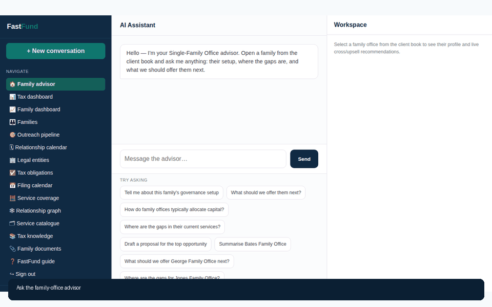
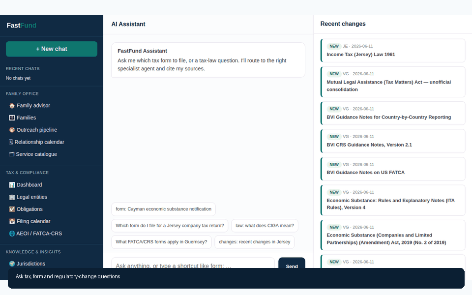

# FastFund

Open-source family-office relationship management and multijurisdiction tax
filing intelligence in one application.

FastFund joins the full family-office outreach workflow—family profiles,
portfolios, service coverage, recommendations, proposals and follow-ups—with
the full tax workflow—legal entities, filing obligations, calendars, official
forms, regulatory change tracking, FATCA/CRS and cited tax-law answers.

### Family-office outreach



### Multijurisdiction tax filings



## Product areas

### Family Office

- Conversational family-office advisor
- Families, principals, advisers and relationship context
- Portfolio holdings and recent transactions
- Explainable service-gap and cross-sell recommendations
- Outreach pipeline, proposals, consultations and next actions
- Service coverage matrix and relationship graph
- Family document storage

### Tax & Compliance

- Legal entities linked to their owning family office
- Multijurisdiction filing obligations and deadlines
- Filing calendar and operational status tracking
- FATCA/CRS and W-8 readiness workflows
- Official forms, legislation, guidance and treaties
- Immutable document versions and regulatory change summaries
- Citation-aware tax-law assistant and provenance graph

## Unified model

```text
FamilyOffice
  ├── FamilyMember
  ├── Holding
  ├── RelationshipAction
  ├── ServiceRecommendation ── Service
  └── OWNS_ENTITY ── LegalEntity
                       ├── FilingObligation ── TaxForm
                       └── IN_JURISDICTION ── Jurisdiction
                                                   └── TaxDocument
                                                        ├── Version
                                                        ├── Change
                                                        └── Citation
```

SQLite/Postgres and Neo4j implement the same public storage behavior. FastFund
uses one database URL, one application process, one identity configuration and
one navigation system for both domains.

## Quick start

```bash
python3.12 -m venv .venv
. .venv/bin/activate
pip install -r requirements.txt
cp .env.example .env

# For a zero-infrastructure local run:
sed -i 's/^DATA_STORAGE=.*/DATA_STORAGE=sqlite/' .env

# Seed family-office demo data.
python -m family.data.synth --count 80 --seed 7

# Load configured tax forms and source material as required.
python -m ingest.cli --list

python -m uvicorn web.app:app --port 5011
```

Open <http://localhost:5011>. The default development credentials come from
`ADMIN_EMAIL` and `ADMIN_PASSWORD` in `.env`. Set `FASTFUND_PUBLIC=1` only for a
local, unauthenticated demonstration.

The family-office workspace is served at `/family/`; tax and knowledge routes
share the main application. Both workspaces use the same FastFund navigation
and database configuration.

## Configuration

Important variables are documented in `.env.example`:

- `DATA_STORAGE=sqlite|neo4j`
- `DB_URL=sqlite:///fastfund.db`
- `NEO4J_URI`, `NEO4J_USER`, `NEO4J_PASSWORD`, `NEO4J_DATABASE`
- `LLM_PROVIDER`, `XAI_API_KEY`, `AZURE_AI_FOUNDRY_*`
- `APP_SECRET`, `ADMIN_EMAIL`, `ADMIN_PASSWORD`
- `GOOGLE_CLIENT_*`, `GOOGLE_ALLOWED_DOMAINS`
- `DOC_STORAGE`, `DOC_LOCAL_DIR`, and optional R2 credentials

Without an LLM key, deterministic recommendations, filing workflows, document
navigation and retrieval remain available; AI synthesis degrades gracefully.

## Data and ingestion

```bash
# Family-office catalogue and synthetic book
python -m family.data.synth --count 80

# List or ingest configured official tax sources
python -m ingest.cli --list
python -m ingest.cli --jurisdiction JE
python -m ingest.cli --all --no-ai

# Tax database statistics and recent changes
python -m ingest.cli --stats
python -m ingest.cli --changes
```

The demo generator creates fictional data only.

## Tests

```bash
python -m pytest tests -q
```

The suite covers:

- Tax storage and platform behavior
- Family-office storage behavior
- SQLite/Neo4j contract parity where Neo4j is reachable
- The combined FastFund route surface
- Family-office ownership of legal entities

## Docker

```bash
docker compose up -d web
docker compose run --rm scrape --all
```

The application listens on port `5011`. SQLite data and captured documents use
the `fastfund-data` volume. A self-hosted Neo4j service is available through the
`neo4j` profile; AuraDB can be selected using environment variables.

## Documentation

- [FastFund user guide](docs/fastfund_user_guide.md)
- [Architecture](docs/architecture_readme.md)
- In-app guide: `/help`

Generated PDF, PowerPoint, screenshots and demonstration GIFs are stored under
`docs/`.

## License

Apache License 2.0. See [LICENSE](LICENSE).
