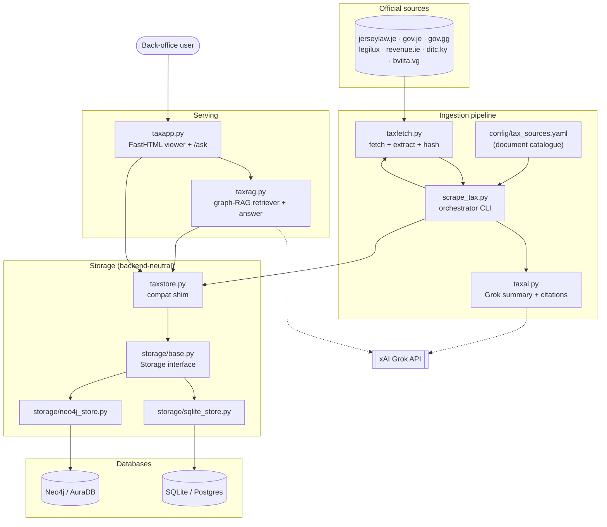
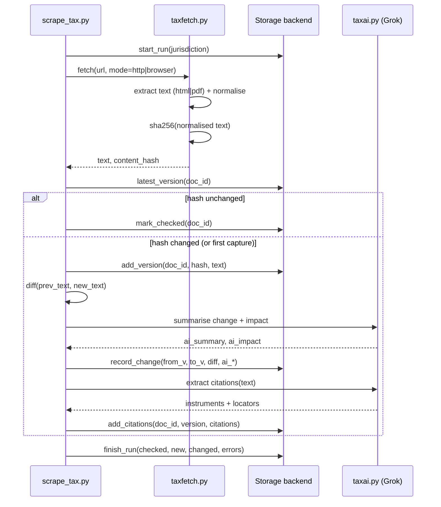
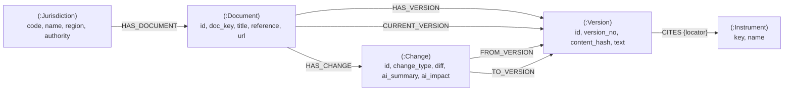
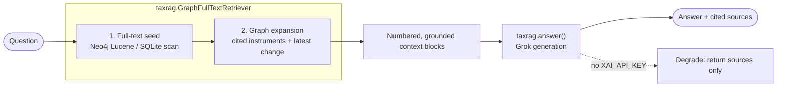
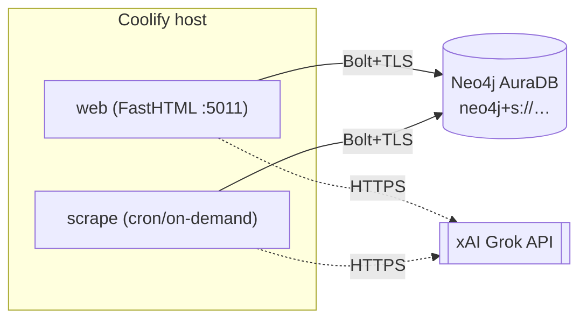

# TaxHub — Architecture

Tax-law traceability for a fund-management back office. TaxHub scrapes official
tax documents across the jurisdictions JTC Group operates in, captures **every
version**, detects and explains **every change**, traces guidance back to the
**primary law** it interprets, and answers questions over the resulting
citation/change graph.

This document describes the implemented system: components, data model, data
flow, the graph-RAG agent, configuration, and deployment (local → Coolify →
AuraDB). For a quick start see the top-level [`README.md`](../README.md).

---

## 1. Current features

| Area | Feature | Where |
|------|---------|-------|
| **Ingest** | Config-driven catalogue, one entry per document | `config/tax_sources.yaml` |
| | HTTP + headless-browser fetch (JS/UA-gated sites) | `taxfetch.py` |
| | HTML + PDF text extraction, normalised + SHA-256 hashed | `taxfetch.py` |
| **Versioning** | Immutable version appended only when the content hash changes | `storage/*`, `scrape_tax.py` |
| | Consecutive-version diffs (added/removed chars + diff text) | `scrape_tax.py`, `taxai.py` |
| **AI** | Grok plain-English change summary + back-office impact | `taxai.py` |
| | Citation extraction (guidance → statutory instruments) | `taxai.py` |
| | Graceful degradation when no `XAI_API_KEY` is set | `taxai.py`, `taxrag.py` |
| **Storage** | Backend-neutral `Storage` interface | `storage/base.py` |
| | Neo4j graph backend (default) | `storage/neo4j_store.py` |
| | SQLite / Postgres relational backend | `storage/sqlite_store.py` |
| | One-line backend switch via `DATA_STORAGE` | `storage/__init__.py` |
| | SQLite → Neo4j backfill migration | `migrate_sqlite_to_neo4j.py` |
| **Graph-RAG** | "Ask the law": full-text seed → graph expansion → Grok answer with cited sources | `taxrag.py`, `/ask` |
| **Web app** | FastHTML viewer: jurisdictions, documents, versions, changes, citations | `taxapp.py` |
| **CLI** | `--list / --jurisdiction / --all / --changes / --stats / --no-ai` | `scrape_tax.py` |
| **Ops** | Healthcheck, Dockerfile, Coolify-labelled compose, user-owned local Neo4j | `docker-compose.yaml`, `scripts/neo4j_local.sh` |
| **Tests** | Cross-backend storage contract + no-network RAG smoke | `tests/` |

### Web routes (`taxapp.py`, port 5011)

| Route | Purpose |
|-------|---------|
| `/health` | Liveness probe (used by the compose healthcheck) |
| `/login`, `/logout` | Session auth (admin seeded by `init_db`) |
| `/` | Dashboard: jurisdictions with document counts |
| `/jurisdiction/{code}` | Documents in a jurisdiction |
| `/document/{doc_id}` | Version history, changes, citations for a document |
| `/changes` | Recent changes across all jurisdictions |
| `/change/{change_id}` | A single change: diff + AI summary + impact |
| `/ask` (GET/POST) | Graph-RAG Q&A over the corpus |

---

## 2. Component architecture



`DATA_STORAGE` selects exactly one backend at runtime; both implement the same
`Storage` interface, so no caller (app, CLI, RAG) knows which database is live.

---

## 3. Scrape & versioning flow

How one document moves from source to a stored, diffed, AI-summarised version:



Versions are **immutable and append-only** — the audit trail of how the law
changed. A change row is written only on an actual content-hash difference.

---

## 4. Graph data model (Neo4j)



Design notes:

- **Stable integer ids** are minted from a `(:Counter)` node, so `/document/{id}`
  URLs work identically across backends and the deprecated `id()` function is
  avoided — portable straight to AuraDB.
- **Citations are first-class edges** (`(:Version)-[:CITES]->(:Instrument)`),
  which is exactly what graph-RAG traverses.
- **Null properties are re-materialised** on read (Neo4j omits null keys; the app
  expects every column present) so the two backends are behaviourally identical.
- **Version-tolerant DDL**: `init_db` tries 5.x syntax (`REQUIRE`,
  `CREATE FULLTEXT INDEX`) and falls back to 4.x (`ASSERT`, fulltext procedure),
  so the same code runs on local Neo4j 4.x and AuraDB 5.x.

The relational backend stores the same shape as tables: `jurisdictions`,
`tax_documents`, `document_versions`, `document_changes`, `citations`,
`scrape_runs`, `users`.

---

## 5. Graph-RAG — "Ask the law"



Retrieval and generation are **deliberately separated** (`Retriever` ABC +
`answer()`), so a `VectorRetriever` can be dropped in later without touching
answer generation. **Embeddings are deferred** — today retrieval is full-text +
graph traversal, not vectors.

---

## 6. Environment variables

Copy `.env.example` → `.env` (gitignored). All variables:

| Variable | Required | Default | Purpose |
|----------|----------|---------|---------|
| `DATA_STORAGE` | yes | `neo4j` | Active backend: `neo4j` or `sqlite` |
| `DB_URL` | sqlite mode | `sqlite:///taxhub.db` | SQLite/Postgres DSN; also the migration **source** |
| `NEO4J_URI` | neo4j mode | `bolt://localhost:7687` | Bolt URI. AuraDB: `neo4j+s://<id>.databases.neo4j.io` |
| `NEO4J_USER` | neo4j mode | `neo4j` | Neo4j username |
| `NEO4J_PASSWORD` | neo4j mode | — | Neo4j password |
| `NEO4J_DATABASE` | no | `neo4j` | Target database name |
| `XAI_API_KEY` | no | — | xAI Grok key; absent → AI features degrade gracefully |
| `XAI_BASE_URL` | no | `https://api.x.ai/v1` | OpenAI-compatible base URL |
| `GROK_MODEL` | no | `grok-4-1-fast-reasoning` | Model id |
| `LLM_PROVIDER` | no | `xai` | Provider selector |
| `ADMIN_EMAIL` | yes | `admin@jtgroup.com` | Seeded admin login |
| `ADMIN_PASSWORD` | yes | — | Seeded admin password |
| `APP_SECRET` | yes (prod) | — | Session signing secret |
| `PORT` | no | `5011` | Web app port |

---

## 7. Deployment

### 7.1 Local dev (user-owned Neo4j, no sudo)

```bash
scripts/neo4j_local.sh setup     # one-time: build config + set initial password
scripts/neo4j_local.sh start     # bolt://localhost:7687, http://localhost:7474
python3.12 migrate_sqlite_to_neo4j.py --wipe   # backfill the graph from SQLite
python3.12 -m uvicorn taxapp:app --port 5011
```

Run on SQLite instead with `DATA_STORAGE=sqlite` (no Neo4j needed).

### 7.2 Coolify / Docker Compose

The `web` service is Coolify-labelled (`coolify.managed`, `coolify.port=5011`)
with a `/health` healthcheck. The `scrape` service (profile `tools`) shares the
data volume for on-demand/scheduled runs.

```bash
docker compose up -d web
docker compose run --rm scrape --all      # populate / refresh the corpus
```

Point `NEO4J_URI` at AuraDB (recommended) **or** bring up the bundled Neo4j:

```bash
docker compose --profile neo4j up -d      # self-hosted neo4j:5.26-community
```

### 7.3 AuraDB (recommended production graph)



Steps:

1. Create a free/Pro AuraDB instance at <https://console.neo4j.io>; download the
   generated credentials.
2. Set in the Coolify environment:
   ```
   DATA_STORAGE=neo4j
   NEO4J_URI=neo4j+s://<id>.databases.neo4j.io
   NEO4J_USER=<id>          # see note below
   NEO4J_PASSWORD=<generated>
   NEO4J_DATABASE=<id>      # see note below
   ```
   (`neo4j+s://` enables Bolt over TLS — required by Aura.) **Gotcha:** on
   AuraDB *Free*, the username and the database name are **the instance id**
   (e.g. `05a16101`), **not** `neo4j` — connecting to database `neo4j` fails
   with `DatabaseNotFound`. Use the exact values from the credentials file Aura
   downloads at creation time (it's shown only once). On Professional the
   username/database are typically `neo4j`; either way, trust the downloaded
   credentials file.
3. Initialise the schema (idempotent, version-tolerant 4.x/5.x DDL):
   ```bash
   docker compose run --rm scrape --stats   # or: python3.12 taxstore.py
   ```
4. Backfill from an existing SQLite corpus, if any:
   ```bash
   DB_URL=sqlite:///taxhub.db python3.12 migrate_sqlite_to_neo4j.py --wipe
   ```
5. Schedule the scraper (e.g. Coolify cron) to build change history over time.

No application code changes between local Neo4j 4.x and AuraDB 5.x — only the
four `NEO4J_*` variables.

---

## 8. Testing

```bash
python3.12 -m pytest tests/ -q
```

- `tests/test_storage.py` — one contract suite parametrised over **both**
  backends, so `DATA_STORAGE` can't silently change behaviour. The Neo4j case
  skips if no Neo4j is reachable and cleans up its own `T9` subgraph.
- `tests/test_rag.py` — no-network RAG smoke (seeds a temp SQLite store, stubs
  Grok off, asserts retrieval + graceful degradation).

---

## 9. Roadmap — what to do next

Ordered by leverage:

1. **Deploy to AuraDB + Coolify** (§7.3) and point `taxhub.predictivelabs.ai` at
   it. First real production target.
2. **Schedule the scraper** (daily/weekly cron) so change history accrues — the
   product's core value is the *change* trail, which only exists once scrapes run
   repeatedly.
3. **Vector embeddings** — add a `VectorRetriever` behind the existing `Retriever`
   ABC (AuraDB has native vector indexes). Upgrades `/ask` from full-text to
   semantic with no change to `answer()`.
4. **Change digest / alerts** — email or in-app digest of recent changes per
   jurisdiction (the "back-office alert" use case).
5. **Harden gated sources** — `guernseylegalresources.gg` (Cloudflare) still
   under-fetches; revisit fetch strategy.
6. **Clean up leftover carhero scaffold** — `db.py`, `main.py`, `agents/`, old
   tests are unused by the TaxHub pipeline.
7. **Auth & multi-user** — move beyond the single seeded admin if more than the
   back-office team needs access.
