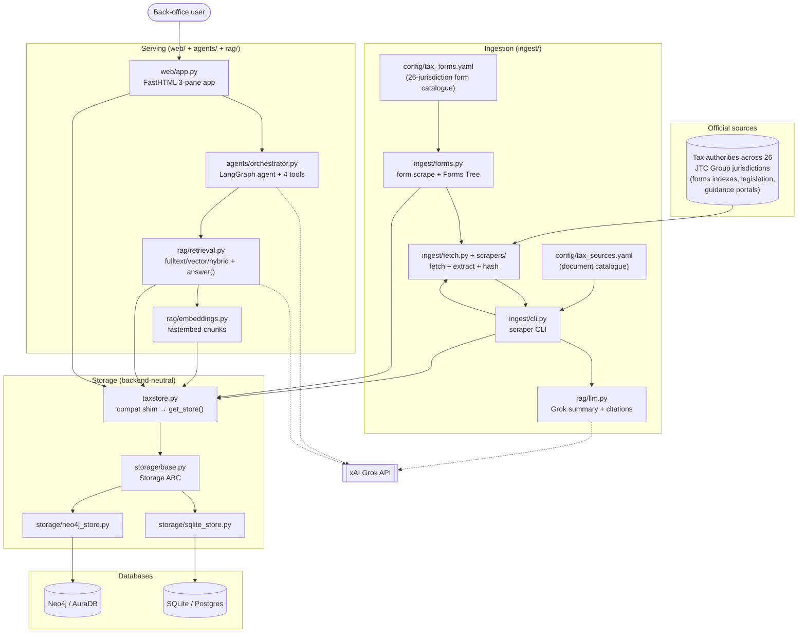
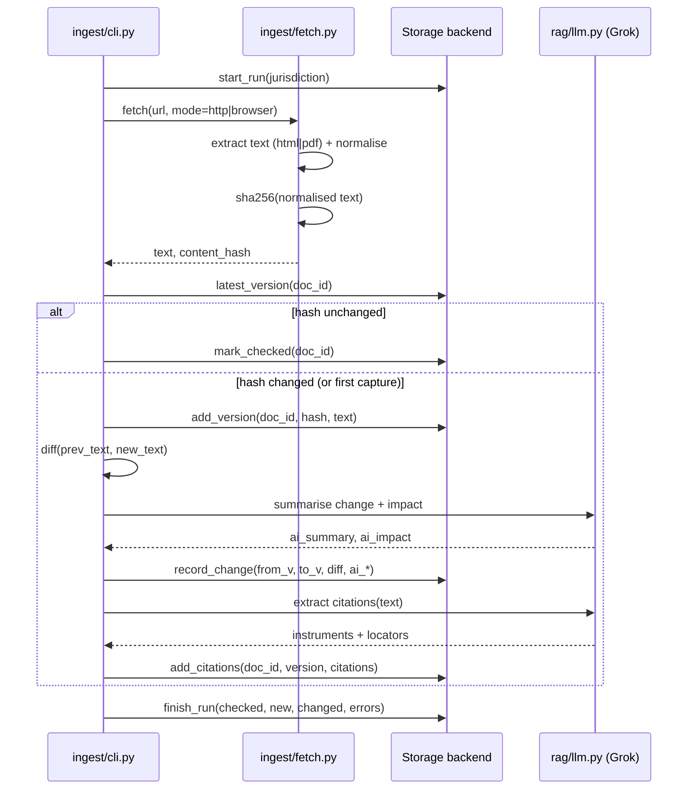
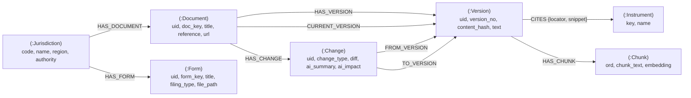
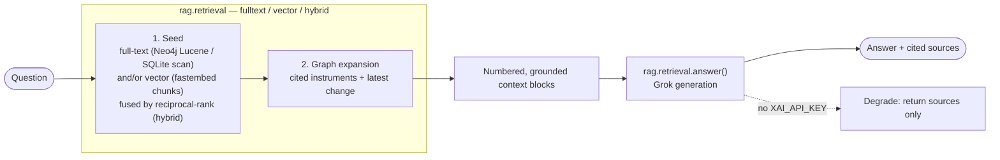
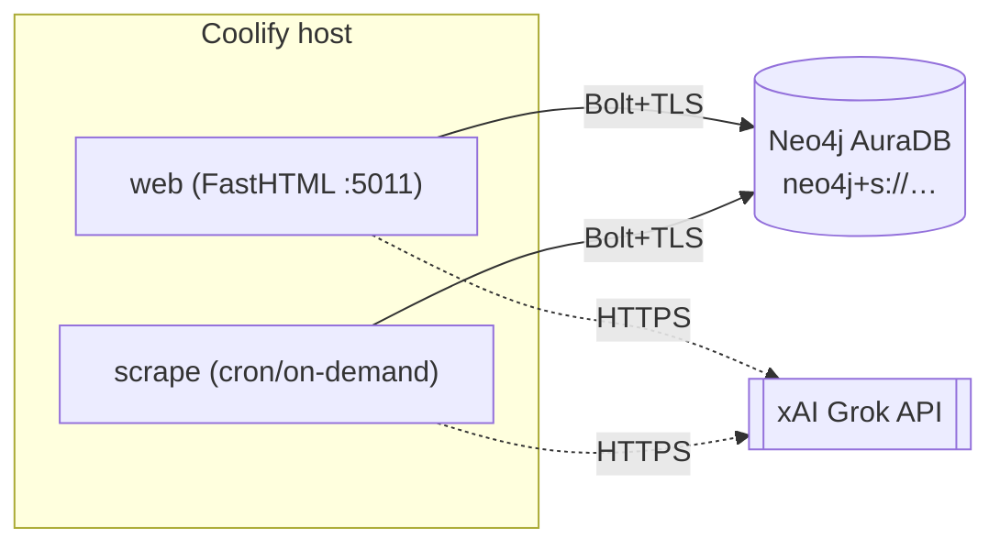

# TaxHub — Architecture

[TOC]

Tax-form finding and tax-law traceability for a fund-management back office.
TaxHub's primary job is to help the back office find the **correct tax form** to
file across the jurisdictions JTC Group operates in; secondarily it scrapes
official tax documents, captures **every version**, detects and explains **every
change**, traces guidance back to the **primary law** it interprets, and answers
questions over the resulting citation/change graph.

This document describes the implemented system: components, data model, data
flow, the LangGraph agent orchestrator + graph-RAG retrieval, configuration, and
deployment (local → Coolify → AuraDB). For a quick start see the top-level
[`README.md`](../README.md).

---

## 1. Current features

| Area | Feature | Where |
|------|---------|-------|
| **Forms** | Config-driven form catalogue, 26 jurisdictions | `config/tax_forms.yaml`, `ingest/forms.py` |
| | Form metadata + PDF download / discover-all over authority indexes | `ingest/forms.py`, `ingest/scrapers/` |
| | Forms Tree taxonomy (jurisdiction → category → type → form) | `ingest/forms.py:forms_tree` |
| **Ingest** | Config-driven document catalogue | `config/tax_sources.yaml`, `ingest/cli.py` |
| | HTTP + headless-browser fetch (JS/UA-gated sites) | `ingest/fetch.py`, `ingest/scrapers/` |
| | HTML + PDF text extraction, normalised + SHA-256 hashed | `ingest/fetch.py` |
| **Versioning** | Immutable version appended only when the content hash changes | `storage/*`, `ingest/cli.py` |
| | Consecutive-version diffs (added/removed chars + diff text) | `ingest/cli.py`, `rag/llm.py` |
| **AI** | Grok plain-English change summary + back-office impact | `rag/llm.py` |
| | Citation extraction (guidance → statutory instruments) | `rag/llm.py` |
| | Graceful degradation when no `XAI_API_KEY` is set | `rag/llm.py`, `rag/retrieval.py`, `agents/orchestrator.py` |
| **Agents** | LangGraph tool-calling orchestrator routing to 4 specialist agents | `agents/orchestrator.py`, `agents/tools.py` |
| | SSE token + tool-step streaming to the UI | `agents/sse.py`, `agents/orchestrator.py` |
| **Storage** | Backend-neutral `Storage` interface | `storage/base.py` |
| | Neo4j graph backend (default) | `storage/neo4j_store.py` |
| | SQLite / Postgres relational backend | `storage/sqlite_store.py` |
| | One-line backend switch via `DATA_STORAGE` | `storage/__init__.py` |
| | SQLite → Neo4j backfill migration | `scripts/migrate_sqlite_to_neo4j.py` |
| **Retrieval** | Full-text seed → graph expansion → Grok answer with cited sources | `rag/retrieval.py` |
| | Vector + hybrid (RRF) retrievers over fastembed chunk embeddings | `rag/retrieval.py`, `rag/embeddings.py` |
| | Chunk-embedding backfill | `scripts/embed_backfill.py` |
| **Web app** | FastHTML 3-pane agentic app: Forms Tree, AI chat, changes/PDF viewer | `web/app.py` |
| **CLI** | `--list / --jurisdiction / --all / --changes / --stats / --no-ai` | `ingest/cli.py` |
| **Ops** | Healthcheck, Dockerfile, Coolify-labelled compose, user-owned local Neo4j | `docker-compose.yaml`, `scripts/neo4j_local.sh` |
| **Tests** | Cross-backend storage contract + no-network RAG smoke | `tests/` |
| **Evals** | Retriever comparison harness over a ground-truth set | `evals/` |

### Web routes (`web/app.py`, port 5011)

| Route | Purpose |
|-------|---------|
| `/health` | Liveness probe (used by the compose healthcheck) |
| `/login`, `/logout` | Session auth (admin seeded by `init_db`) |
| `/` | 3-pane app: Forms Tree + AI Assistant chat + changes newsfeed |
| `/chat` (POST) | SSE stream from the LangGraph orchestrator (or shortcut routing) |
| `/dashboard` | Corpus stats + jurisdictions with document counts |
| `/jurisdictions`, `/jurisdiction/{code}` | Jurisdiction list / documents in a jurisdiction |
| `/documents`, `/upload` | Stored-PDF browser with filters; upload a PDF to the volume |
| `/document/{doc_id}` | Version history, changes, citations for a document |
| `/form/{form_id}`, `/form-pdf/{form_id}` | Form metadata + embedded PDF viewer |
| `/changes`, `/api/feed` | Recent changes across all jurisdictions / feed partial |
| `/help`, `/user-guide-pdf` | In-app help + the generated User Guide PDF |

### Jurisdiction coverage

The form catalogue (`config/tax_forms.yaml`) covers **26 jurisdictions** — the
six live-MVP fund domiciles plus an expansion to all JTC Group office
jurisdictions:

> **Live MVP:** Jersey (JE), Guernsey (GG), Luxembourg (LU), Ireland (IE),
> Cayman Islands (KY), British Virgin Islands (VG).
>
> **Expansion:** Isle of Man (IM), Mauritius (MU), Malta (MT), Cyprus (CY),
> Netherlands (NL), Switzerland (CH), United Kingdom (GB), Germany (DE),
> Austria (AT), Poland (PL), United States (US), Hong Kong (HK), Singapore (SG),
> Malaysia (MY), New Zealand (NZ), United Arab Emirates (AE), Bahamas (BS),
> Brazil (BR), South Africa (ZA), Bermuda (BM).

Each form is labelled by **filing type** — `downloadable` (a PDF to complete),
`online` (web portal / e-file), or `reference` (guidance, not a fileable form).
Most jurisdictions file online, but a subset publishes **downloadable PDFs** —
notably the US (IRS), Hong Kong, New Zealand, Poland, Austria, Bermuda,
Luxembourg, and Guernsey — which TaxHub fetches and stores locally for the
in-app PDF viewer.

> The document/legislation catalogue (`config/tax_sources.yaml`) used for
> versioning + graph-RAG currently tracks the original six MVP jurisdictions.

---

## 2. Component architecture



`DATA_STORAGE` selects exactly one backend at runtime; both implement the same
`Storage` interface, so no caller (app, agents, retrieval, CLI) knows which
database is live. The top-level `taxstore.py` is a thin compat shim that
re-exports the active store from `storage.get_store()`.

---

## 3. Scrape & versioning flow

How one document moves from source to a stored, diffed, AI-summarised version:



Versions are **immutable and append-only** — the audit trail of how the law
changed. A change row is written only on an actual content-hash difference.

---

## 4. Graph data model (Neo4j)



Design notes:

- **Stable integer ids** (`uid`) are minted from a `(:Counter)` node, so
  `/document/{id}` and `/form/{id}` URLs work identically across backends and
  the deprecated `id()` function is avoided — portable straight to AuraDB.
- **Citations are first-class edges** (`(:Version)-[:CITES]->(:Instrument)`),
  which is exactly what graph-RAG traverses.
- **Forms are first-class nodes** (`(:Jurisdiction)-[:HAS_FORM]->(:Form)`),
  classified by category + form_type to build the Forms Tree, and distinct from
  legislation/guidance `Document` nodes.
- **Chunk vectors** (`(:Version)-[:HAS_CHUNK]->(:Chunk)`) carry per-passage
  embeddings for vector/hybrid retrieval, backed by a Neo4j native `VECTOR INDEX`
  (cosine).
- **Null properties are re-materialised** on read (Neo4j omits null keys; the app
  expects every column present) so the two backends are behaviourally identical.
- **Version-tolerant DDL**: `init_db` tries 5.x syntax (`REQUIRE`,
  `CREATE FULLTEXT INDEX`) and falls back to 4.x (`ASSERT`, `db.index.fulltext`
  procedure), so the same code runs on local Neo4j 4.x and AuraDB 5.x.

The relational backend stores the same shape as tables: `jurisdictions`,
`tax_documents`, `document_versions`, `document_changes`, `citations`,
`version_chunks`, `tax_forms`, `scrape_runs`, `users`, plus chat history
(`chat_sessions`, `chat_messages`).

---

## 5. Agents + Graph-RAG — the assistant

The web app's chat routes every message to a **LangGraph tool-calling
orchestrator** (`agents/orchestrator.py`, `create_react_agent`). The
orchestrator picks the right specialist agent — exposed as the four tools in
`agents/tools.py` — and streams tokens and tool steps back over SSE:

| Tool | Job |
|------|-----|
| `document_agent` | Find the correct tax FORM(s) for a need (the primary use case) |
| `law_agent` | Tax-LAW Q&A via graph-RAG over the tracked corpus, with citations |
| `metadata_agent` | Structured lookup: forms / deadlines for a jurisdiction or category |
| `changes_agent` | Recent changes to tracked documents |

`law_agent` delegates to graph-RAG retrieval:



Retrieval and generation are **deliberately separated** (`Retriever` ABC +
`answer()`). Three retrievers implement the ABC — `GraphFullTextRetriever`,
`VectorRetriever`, and `HybridRetriever` — selected by `RAG_RETRIEVER` (default
`hybrid`). **Embeddings are local fastembed** (`BAAI/bge-small-en-v1.5`, 384-dim;
`rag/embeddings.py`), chunked per passage and stored as `(:Chunk)` nodes /
`version_chunks` rows. Vector and hybrid retrievers **degrade to full-text**
when no embeddings/chunks are present, so the assistant works with or without a
backfill (`scripts/embed_backfill.py`).

---

## 6. Environment variables

Copy `.env.example` → `.env` (gitignored). All variables:

| Variable | Required | Default | Purpose |
|----------|----------|---------|---------|
| `DATA_STORAGE` | yes | `neo4j` | Active backend: `neo4j` or `sqlite` |
| `DB_URL` | sqlite mode | `sqlite:///taxhub.db` | SQLite/Postgres DSN; also the migration **source** |
| `NEO4J_URI` | neo4j mode | `bolt://localhost:7687` | Bolt URI. AuraDB: `neo4j+s://<id>.databases.neo4j.io` |
| `NEO4J_USER` | neo4j mode | `neo4j` | Neo4j username |
| `NEO4J_PASSWORD` | neo4j mode | — | Neo4j password |
| `NEO4J_DATABASE` | no | `neo4j` | Target database name |
| `XAI_API_KEY` | no | — | xAI Grok key; absent → AI features degrade gracefully |
| `XAI_BASE_URL` | no | `https://api.x.ai/v1` | OpenAI-compatible base URL |
| `GROK_MODEL` | no | `grok-4-1-fast-reasoning` | Model id |
| `LLM_PROVIDER` | no | `xai` | Provider selector |
| `RAG_RETRIEVER` | no | `hybrid` | Retriever: `hybrid`, `vector`, or `fulltext` |
| `EMBEDDINGS` | no | `fastembed` | Embedding provider: `fastembed` or `openai` |
| `EMBED_MODEL` | no | `BAAI/bge-small-en-v1.5` | Embedding model id |
| `EMBED_DIM` | no | `384` | Embedding dimensions (must match the model) |
| `ADMIN_EMAIL` | yes | `admin@example.com` | Seeded admin login |
| `ADMIN_PASSWORD` | yes | _(set in env)_ | Seeded admin password (set a strong value in prod) |
| `APP_SECRET` | yes (prod) | _(set in env)_ | Session signing secret (set a random value in prod) |
| `TAXHUB_PUBLIC` | no | `0` | `1` disables login (public/demo mode) |
| `PORT` | no | `5011` | Web app port |

---

## 7. Deployment

### 7.1 Local dev (user-owned Neo4j, no sudo)

```bash
scripts/neo4j_local.sh setup     # one-time: build config + set initial password
scripts/neo4j_local.sh start     # bolt://localhost:7687, http://localhost:7474
python3.12 scripts/migrate_sqlite_to_neo4j.py --wipe   # backfill the graph from SQLite
python3.12 -m uvicorn web.app:app --port 5011
```

Run on SQLite instead with `DATA_STORAGE=sqlite` (no Neo4j needed).

### 7.2 Coolify / Docker Compose

The `web` service is Coolify-labelled (`coolify.managed`, `coolify.port=5011`)
with a `/health` healthcheck. The `scrape` service (profile `tools`) shares the
data volume for on-demand/scheduled runs.

```bash
docker compose up -d web
docker compose run --rm scrape --all      # populate / refresh the corpus
```

Point `NEO4J_URI` at AuraDB (recommended) **or** bring up the bundled Neo4j:

```bash
docker compose --profile neo4j up -d      # self-hosted neo4j:5.26-community
```

### 7.3 AuraDB (recommended production graph)



Steps:

1. Create a free/Pro AuraDB instance at <https://console.neo4j.io>; download the
   generated credentials.
2. Set in the Coolify environment:
   ```
   DATA_STORAGE=neo4j
   NEO4J_URI=neo4j+s://<id>.databases.neo4j.io
   NEO4J_USER=<id>          # see note below
   NEO4J_PASSWORD=<generated>
   NEO4J_DATABASE=<id>      # see note below
   ```
   (`neo4j+s://` enables Bolt over TLS — required by Aura.) **Gotcha:** on
   AuraDB *Free*, the username and the database name are **the instance id**
   (e.g. `05a16101`), **not** `neo4j` — connecting to database `neo4j` fails
   with `DatabaseNotFound`. Use the exact values from the credentials file Aura
   downloads at creation time (it's shown only once). On Professional the
   username/database are typically `neo4j`; either way, trust the downloaded
   credentials file.
3. Initialise the schema (idempotent, version-tolerant 4.x/5.x DDL):
   ```bash
   docker compose run --rm scrape --stats   # or: python3.12 taxstore.py
   ```
4. Backfill from an existing SQLite corpus, if any:
   ```bash
   DB_URL=sqlite:///taxhub.db python3.12 scripts/migrate_sqlite_to_neo4j.py --wipe
   ```
5. Schedule the scraper (e.g. Coolify cron) to build change history over time.

No application code changes between local Neo4j 4.x and AuraDB 5.x — only the
four `NEO4J_*` variables.

---

## 8. Testing

```bash
python3.12 -m pytest tests/ -q
```

- `tests/test_storage.py` — one contract suite parametrised over **both**
  backends, so `DATA_STORAGE` can't silently change behaviour. The Neo4j case
  skips if no Neo4j is reachable and cleans up its own `T9` subgraph.
- `tests/test_rag.py` — no-network RAG smoke (seeds a temp SQLite store, stubs
  Grok off, asserts retrieval + graceful degradation).

---

## 9. Roadmap — what to do next

Ordered by leverage:

1. **Deploy to AuraDB + Coolify** (§7.3) and point `taxhub.predictivelabs.ai` at
   it. First real production target.
2. **Schedule the scraper** (daily/weekly cron) so change history accrues — the
   product's core value is the *change* trail, which only exists once scrapes run
   repeatedly.
3. **Backfill embeddings at scale** — `VectorRetriever`/`HybridRetriever` and
   `scripts/embed_backfill.py` already exist (AuraDB native vector index, local
   fastembed). Run the backfill across the full corpus so `/chat` law answers are
   semantic-by-default rather than degrading to full-text.
4. **Change digest / alerts** — email or in-app digest of recent changes per
   jurisdiction (the "back-office alert" use case).
5. **Harden gated sources** — JS/UA-gated authority sites (e.g. Jersey, Guernsey)
   still under-fetch some forms; revisit the browser fetch strategy.
6. **Broaden the document/legislation catalogue** — `config/tax_sources.yaml`
   tracks only the six MVP jurisdictions for versioning + graph-RAG; extend it
   toward the 26 jurisdictions already in the form catalogue.
7. **Auth & multi-user** — move beyond the single seeded admin if more than the
   back-office team needs access.
