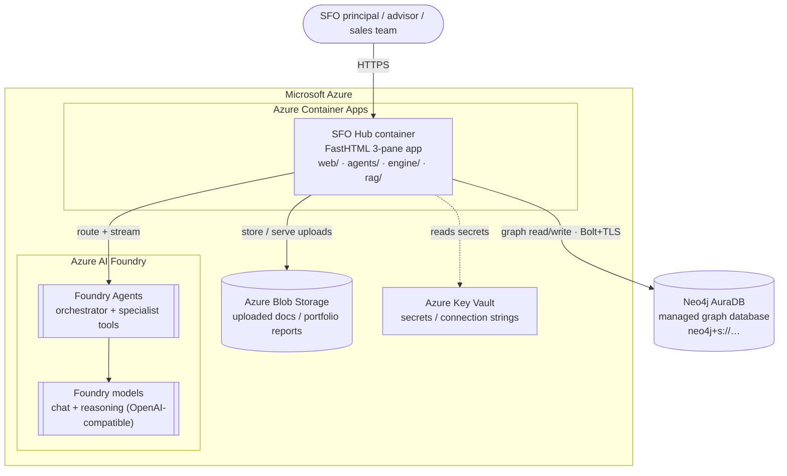
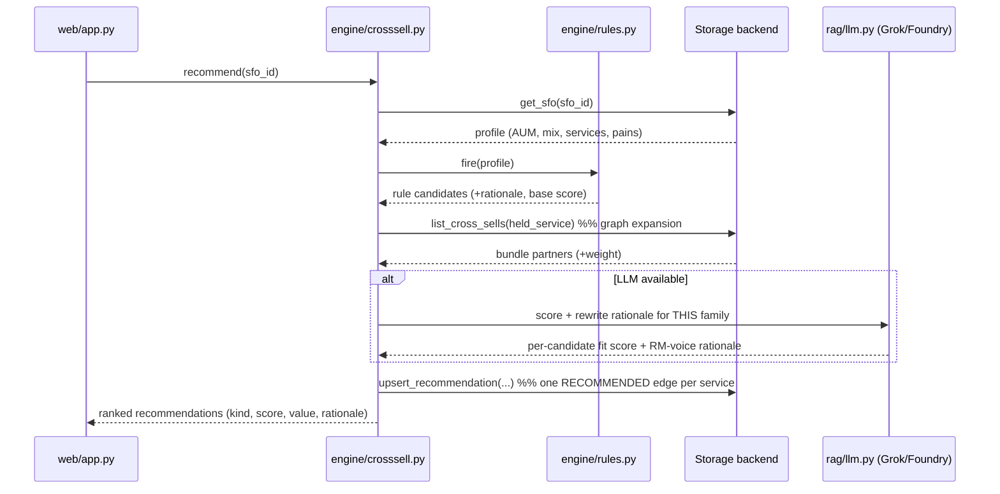
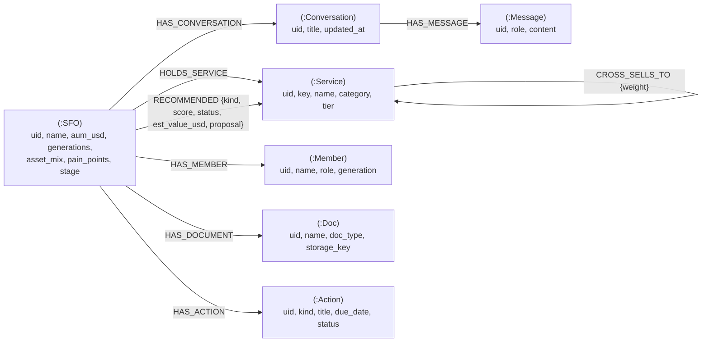

# SFO Hub — Architecture & Implementation Plan

[TOC]

An AI conversational advisor that **cross-sells and upsells to single family
offices (SFOs)** — a simulated JTC Private Office relationship manager. It
engages principals/advisors in natural dialogue, analyses the family's profile,
and surfaces personalised, traceable service recommendations, with an analytics
dashboard over the resulting cross/upsell funnel.

This document describes the implemented MVP: components, data model, data flow,
the agent orchestrator, the hybrid cross/upsell engine, configuration, and the
**target production deployment on Microsoft Azure** — Azure AI Foundry (LLMs +
Agents), Azure Blob Storage (document uploads), and a managed **Neo4j AuraDB**
graph. It mirrors the architecture of the sister app
[TaxHub](../../taxhub/docs/architecture_readme.md) so the same operational story,
stack and look-and-feel carry over. For a quick start see
[`README.md`](../README.md); §9 is the phased implementation plan.

---

## 1. Current features (MVP scaffold)

| Area | Feature | Where |
|------|---------|-------|
| **Profiles** | SFO client book — AUM, family/generations, asset mix, services, pain points | `storage/*`, `data/synth.py` |
| | Lifecycle stages (lead → onboarding → client) | `web/app.py`, `data/synth.py` |
| **Services** | JTC Private Office service catalogue (config-driven) | `data/services.yaml` |
| | Cross-sell graph: `(:Service)-[:CROSS_SELLS_TO {weight}]->(:Service)` | `data/services.yaml`, `storage/*` |
| **Engine** | Transparent cross/upsell **rule catalogue** | `engine/rules.py` |
| | **Hybrid** pipeline: rules → graph expansion → AI re-rank → persist | `engine/crosssell.py` |
| | Estimated annual value (AUM × tier basis-points heuristic) | `engine/crosssell.py` |
| **AI** | LangGraph tool-calling advisor (relationship-manager persona) | `agents/orchestrator.py` |
| | Specialist agents: profile / needs / services / recommend / benchmark | `agents/tools.py` |
| | SSE token + tool-step streaming to the UI | `agents/sse.py`, `agents/orchestrator.py` |
| | Graceful degradation when no LLM key is set (rules-only advisor) | `agents/orchestrator.py`, `engine/crosssell.py` |
| **Knowledge** | Services + aggregate industry-benchmark retrieval (keyword) | `rag/knowledge.py` |
| **Storage** | Backend-neutral `Storage` interface | `storage/base.py` |
| | Neo4j graph backend (default) | `storage/neo4j_store.py` |
| | SQLite / Postgres relational backend | `storage/sqlite_store.py` |
| | One-line backend switch via `DATA_STORAGE` | `storage/__init__.py` |
| | AI proposal generation + next-action scheduling | `engine/proposals.py`, `engine/crosssell.py` |
| **Web app** | FastHTML multi-page app over a shared sidebar chrome | `web/app.py` |
| | 3-pane home: client book · AI chat · profile + recommendations | `web/app.py` |
| | SFO detail: Plotly allocation, members, recs, actions, documents, history | `web/app.py` |
| | Opportunities funnel (filterable) + inline funnel-advance actions | `web/app.py` |
| | Pipeline calendar (urgency-coded next actions) | `web/app.py`, `web/monitor.py` |
| | Service coverage matrix (held / recommended / gap) | `web/app.py`, `web/coverage.py` |
| | Relationship graph (vis-network): client book + cross-sell schema | `web/app.py`, `web/graphdata.py` |
| | Analytics dashboard (Plotly): funnel, pipeline value, allocation, heatmap | `web/app.py` |
| | Document upload/browser (R2 / local / Blob) | `web/app.py`, `storage/docstore.py` |
| | Help + technical guide | `web/app.py` |
| **Data** | Synthetic SFO generator (Faker): families, members, conversations, docs, actions | `data/synth.py` |
| **Ops** | Healthcheck, Dockerfile, Coolify-labelled compose, local-Neo4j helper | `Dockerfile`, `docker-compose.yaml`, `scripts/neo4j_local.sh` |
| **Tests** | Cross-backend storage contract suite | `tests/test_storage.py` |
| **Evals** | Recommendation-quality harness over a ground-truth set | `evals/` |

### Web routes (`web/app.py`, port 5021)

| Route | Purpose |
|-------|---------|
| `/health` | Liveness probe (used by the compose healthcheck) |
| `/login`, `/logout` | Session auth (admin seeded by `init_db`) |
| `/` | 3-pane app: client book + AI advisor + profile/recommendations (`?sfo=<id>`) |
| `/chat` (POST) | SSE stream from the LangGraph orchestrator (degrades without a key) |
| `/panel/{sfo_id}` | Right-panel refresh (profile + live recommendations) |
| `/recommend/{sfo_id}` (POST) | Run the hybrid engine for one SFO, re-render the panel |
| `/sfo/{id}` | SFO detail: allocation, members, recs, actions, documents, history |
| `/opportunities` | Every recommendation across the book, filterable |
| `/calendar` | Pipeline calendar of next actions, urgency-coded |
| `/coverage` | Service coverage matrix (held / recommended / gap) |
| `/graph?mode=book\|schema` | Relationship graph (vis-network) |
| `/services`, `/service/{id}` | Service catalogue + detail with cross-sell partners |
| `/documents`, `/upload`, `/document/{id}/file` | Document browser + upload (R2/local) |
| `/dashboard` | Analytics: funnel, pipeline value, allocation, interest heatmap |
| `/rec/{id}/{proposal\|book\|status}` (POST) | Recommendation funnel actions (HTMX) |
| `/help`, `/technical-guide` | In-app help & technical guide |

---

## 2. Architecture — Azure target deployment

The production target runs the containerised app on **Azure**, with the
LLM/agent layer on **Azure AI Foundry**, document uploads in **Azure Blob
Storage**, and the graph on a **managed Neo4j AuraDB** instance — identical to
the TaxHub target, which keeps one operational playbook across both apps.



The application is backend- and provider-neutral, which makes this target clean
to hit:

- **LLM/agents** — the orchestrator (`agents/`) and the AI scorer
  (`engine/crosssell.py`) talk to an **OpenAI-compatible** endpoint, so the same
  code points at Azure AI Foundry model deployments (and Foundry Agents) in
  production by setting `LLM_PROVIDER=azure` + the Azure endpoint/key; no code
  change versus the local Grok client.
- **Graph** — `DATA_STORAGE=neo4j` points at **managed Neo4j AuraDB** over
  Bolt+TLS; the same `Storage` interface backs both backends, so no caller (app,
  agents, engine, seeder) knows which database is live.
- **Documents** — uploaded portfolio summaries / trust deeds (a phase-2 feature,
  §9) live in **Azure Blob Storage** in production; the local filesystem is the
  dev fallback.

---

## 3. Recommendation flow (the hybrid engine)

How one family's profile becomes ranked, costed, persisted recommendations:



The candidate set is **never** invented by the LLM alone — rules and the graph
produce it; the AI only re-ranks and rewrites. Every recommendation is traceable
to the `rule_id` or graph edge that produced it (`source` ∈ rule / graph /
hybrid), which matters for a regulated wealth business.

---

## 4. Graph data model (Neo4j)



Design notes (mirroring TaxHub):

- **Stable integer ids** (`uid`) are minted from a `(:Counter)` node, so
  `/sfo/{id}` / `/service/{id}` URLs work identically across backends and the
  deprecated `id()` function is avoided — portable straight to AuraDB.
- **`CROSS_SELLS_TO` is a first-class edge** — the cross-sell knowledge graph the
  engine traverses, the direct analogue of TaxHub's `CITES`.
- **`RECOMMENDED` carries the funnel** as edge properties (`kind`, `score`,
  `status`, `est_value_usd`) — the analytics read straight off it.
- **List fields** (jurisdictions, current_services, pain_points, keywords) are
  native string arrays; **`asset_mix`** (a map) is JSON-encoded into a string
  property (Neo4j props must be primitives/arrays) and re-materialised on read so
  both backends behave identically.
- **Version-tolerant DDL** — `init_db` tries 5.x `REQUIRE` constraint syntax and
  falls back to 4.x `ASSERT`, so the same code runs on local Neo4j 4.x and
  AuraDB 5.x.

The relational backend stores the same shape as tables: `sfos`, `services`,
`cross_sells`, `recommendations`, `conversations`, `messages`, `users`.

---

## 5. Agents + the advisor

The chat routes every message to a **LangGraph tool-calling orchestrator**
(`agents/orchestrator.py`, `create_react_agent`) playing a JTC Private Office
relationship manager. It picks the right specialist — exposed as the five tools
in `agents/tools.py` — and streams tokens and tool steps back over SSE:

| Tool | Job |
|------|-----|
| `profile_agent` | Ground in WHO the client is (AUM, family, mix, services, pains) |
| `needs_agent` | Detect GAPS from a described setup → JTC service categories |
| `services_agent` | Explain what JTC offers for a topic |
| `recommend_agent` | Produce RANKED cross/upsell recs (runs the hybrid engine) |
| `benchmark_agent` | Aggregate industry context to frame advice with public data |

The currently-open family is passed to the tools via a `contextvar`
(`agents/context.py`) stamped by the web route, so the advisor stays anchored to
the right client without threading the id through every signature. Tool output
carries `[service:N]` / `[sfo:N]` / `[rec:N]` markers the UI renders as
open-in-panel links. Without a key the orchestrator degrades to running the
rule-based recommender directly.

---

## 6. Environment variables

Copy `.env.example` → `.env` (gitignored). Key settings:

| Variable | Required | Default | Purpose |
|----------|----------|---------|---------|
| `DATA_STORAGE` | yes | `neo4j` | Active backend: `neo4j` or `sqlite` |
| `DB_URL` | sqlite mode | `sqlite:///sfohub.db` | SQLite/Postgres DSN |
| `NEO4J_URI` | neo4j mode | `bolt://localhost:7687` | Bolt URI. AuraDB: `neo4j+s://<id>.databases.neo4j.io` |
| `NEO4J_USER` / `NEO4J_PASSWORD` / `NEO4J_DATABASE` | neo4j mode | `neo4j` | Neo4j credentials |
| `LLM_PROVIDER` | no | `xai` | `xai` (dev) or `azure` (production / Azure AI Foundry) |
| `XAI_API_KEY` / `XAI_BASE_URL` / `GROK_MODEL` | no | — / x.ai / grok-4-1-fast-reasoning | xAI Grok (dev); absent → AI degrades |
| `AZURE_AI_FOUNDRY_ENDPOINT` / `AZURE_AI_FOUNDRY_API_KEY` / `FOUNDRY_MODEL` | Azure | — | Azure AI Foundry (set `LLM_PROVIDER=azure`) |
| `DOC_STORAGE` | no | `local` | Document blob store: `local` or `r2` |
| `DOC_LOCAL_DIR` | local | `data/uploads` | Local upload dir (a Coolify persistent volume in dev) |
| `R2_ACCOUNT_ID` / `R2_ACCESS_KEY_ID` / `R2_SECRET_ACCESS_KEY` / `R2_BUCKET` | r2 | — | Cloudflare R2 (S3-compatible) credentials |
| `ADMIN_EMAIL` / `ADMIN_PASSWORD` | yes | admin@jtcgroup.com / change-me | Seeded admin login |
| `SFOHUB_PUBLIC` | no | `0` | `1` disables login (public/demo mode) |
| `APP_SECRET` | yes (prod) | — | Session signing secret |
| `PORT` | no | `5021` | Web app port |

---

## 7. Deployment — Microsoft Azure

### 7.1 Azure service mapping

| Concern | Azure service | Notes |
|---------|---------------|-------|
| App runtime | **Azure Container Apps** | Runs the existing `Dockerfile`; scales to zero; HTTPS ingress + `/health` probe. |
| LLM + agents | **Azure AI Foundry** | Chat/reasoning model consumed over the OpenAI-compatible endpoint; optionally Foundry **Agents**. |
| Graph database | **Neo4j AuraDB** (managed) | Reached over `neo4j+s://` (Bolt+TLS). |
| Document uploads | **Azure Blob Storage** | Portfolio summaries / trust deeds (phase-2 upload feature). |
| Secrets | **Azure Key Vault** | Foundry key, AuraDB password, `APP_SECRET` — referenced as Container App secrets. |
| Registry | **Azure Container Registry** | Stores the built image pulled by Container Apps. |
| Seed / batch | **Container Apps Job** | One-shot `python -m data.synth` to populate a demo book. |

### 7.2 Provision & deploy

```bash
# 0. Variables
RG=sfohub-rg; LOC=westeurope; ACR=sfohubacr; APP=sfohub

# 1. Resource group + registry, build & push the image
az group create -n $RG -l $LOC
az acr create -n $ACR -g $RG --sku Basic --admin-enabled true
az acr build -r $ACR -t sfohub:latest .

# 2. Azure AI Foundry: create a project + deploy a chat model in the portal
#    (ai.azure.com); copy the endpoint + key (and Agent id if used).

# 3. Container Apps environment + app
az containerapp env create -n sfohub-env -g $RG -l $LOC
az containerapp create -n $APP -g $RG --environment sfohub-env \
  --image $ACR.azurecr.io/sfohub:latest --target-port 5021 --ingress external \
  --secrets aura-pass=<AURADB_PASSWORD> foundry-key=<FOUNDRY_KEY> app-secret=<RANDOM> \
  --env-vars DATA_STORAGE=neo4j LLM_PROVIDER=azure \
             NEO4J_URI=neo4j+s://<id>.databases.neo4j.io \
             NEO4J_USER=<id> NEO4J_DATABASE=<id> \
             NEO4J_PASSWORD=secretref:aura-pass \
             AZURE_AI_FOUNDRY_ENDPOINT=<endpoint> FOUNDRY_MODEL=<deployment> \
             AZURE_AI_FOUNDRY_API_KEY=secretref:foundry-key \
             APP_SECRET=secretref:app-secret \
             ADMIN_EMAIL=<email> ADMIN_PASSWORD=secretref:app-secret
```

### 7.3 Managed Neo4j AuraDB

1. Create an AuraDB instance (<https://console.neo4j.io>); **download the
   credentials file — shown once**.
2. Wire the four `NEO4J_*` values into the Container App (step 3 above).
   **Gotcha:** on AuraDB *Free* the username **and** database name are the
   **instance id** (e.g. `05a16101`), not `neo4j` — trust the credentials file.
3. The schema (idempotent, version-tolerant 4.x/5.x DDL) is created on first app
   start (`init_db`), or on demand: `az containerapp exec -n $APP -g $RG --command "python sfostore.py"`.
4. Seed a demo book: `python -m data.synth --count 120` (as a Container Apps Job).

No application code changes are needed to hit this target — only environment
variables: `LLM_PROVIDER=azure` (Foundry) and `DATA_STORAGE=neo4j` with the four
`NEO4J_*` values (AuraDB).

### 7.4 Dev deployment (Coolify / Cloudflare)

Identical to TaxHub: `docker compose up -d web` behind Coolify (the compose file
carries `coolify.managed` / `coolify.port=5021` labels), fronted by Cloudflare.
Use `DATA_STORAGE=sqlite` on the persistent volume for a zero-infra dev box, or
point `NEO4J_*` at AuraDB.

---

## 8. Testing

```bash
python -m pytest tests/ -q
```

- `tests/test_storage.py` — one contract suite parametrised over **both**
  backends, so `DATA_STORAGE` can't silently change behaviour. The Neo4j case
  skips if no Neo4j is reachable.

---

## 9. Implementation plan (phased)

The platform standardises on **PostgreSQL** (data) and **Azure Blob Storage**
(documents). The repo today implements **Phases 0–4** below — deployed to
`sfohub.predictivelabs.ai`. Phases 5–6 are the remaining build-out.

**Phase 0 — Foundations (done).** Backend-neutral `Storage` (PostgreSQL),
service catalogue + cross-sell graph, FastHTML shell with JTC look-and-feel, auth,
Docker/Compose ops, storage contract test.

**Phase 1 — Conversational MVP (done).** LangGraph advisor + 6 specialist agents
(profile, needs, services, recommend, benchmark, data) with SSE streaming; hybrid
cross/upsell engine (rules → graph → AI re-rank); synthetic SFO book + funnel
seeder; analytics dashboard; graceful degradation without an LLM.

**Phase 2 — Insight & document intake (done).** Document upload (portfolio /
trust deed / inventory) to **Azure Blob Storage**, attached to an SFO; **AI
extraction of uploads → structured profile → refreshed recommendations** (incl.
PDF text via pdfminer); AI proposal generation; next-step scheduling; **a new-lead
onboarding wizard** that builds a profile from intake and produces a tailored
service roadmap.

**Phase 3 — Funnel & analytics depth (done).** Opportunities → **kanban pipeline**
(drag-to-advance) with filters; pipeline calendar with urgency + **iCal export**;
coverage matrix; relationship graph (vis-network); **portfolio holdings + cash-flow
transactions with performance** on each SFO; Plotly dashboard (funnel, pipeline
value, allocation, interest heatmap, acceptance rate, **activity trends over time**).
*Remaining:* per-RM breakdowns.

**Phase 4 — Quality (done).** Text-to-SQL **data agent** + recommendation/answer
eval harness over a ground-truth set, judged by Grok and run through the **real
assistant** (`evals/`). *Remaining:* a semantic retrieval upgrade (embeddings +
vector/hybrid retriever behind `rag/knowledge.py`).

**Phase 5 — Compliance, access control & hardening (planned).** The explicit
next step for an enterprise / production posture:
- **Role-based access control (RBAC)** — distinct roles **principal · advisor ·
  sales · admin**, each scoped: principals/advisors see only their family; sales
  see the pipeline; admins see everything and manage users. Enforced in `require()`
  + per-route guards, with the role stored on the `users` record.
- **Audit logs** — an append-only `audit_log` (who, when, what, which SFO) for every
  recommendation status change, proposal generation, document access and profile
  edit; surfaced in an admin view and exportable.
- **GDPR-aligned data handling** — data-subject export/erasure, field-level
  retention, PII minimisation, and consent flags. (The demo is already
  synthetic-only, so no real client data is processed.)
- **Managed identity** — Azure Managed Identity for Blob + AI Foundry instead of
  keys; secrets in Azure Key Vault.
- Real CRM / JTC Edge integration behind the current mock service catalogue.

**Phase 6 — Productisation.** Freemium vs. premium simulation gating;
demo/sales-enablement presets; scheduled refresh of synthetic books for training.
