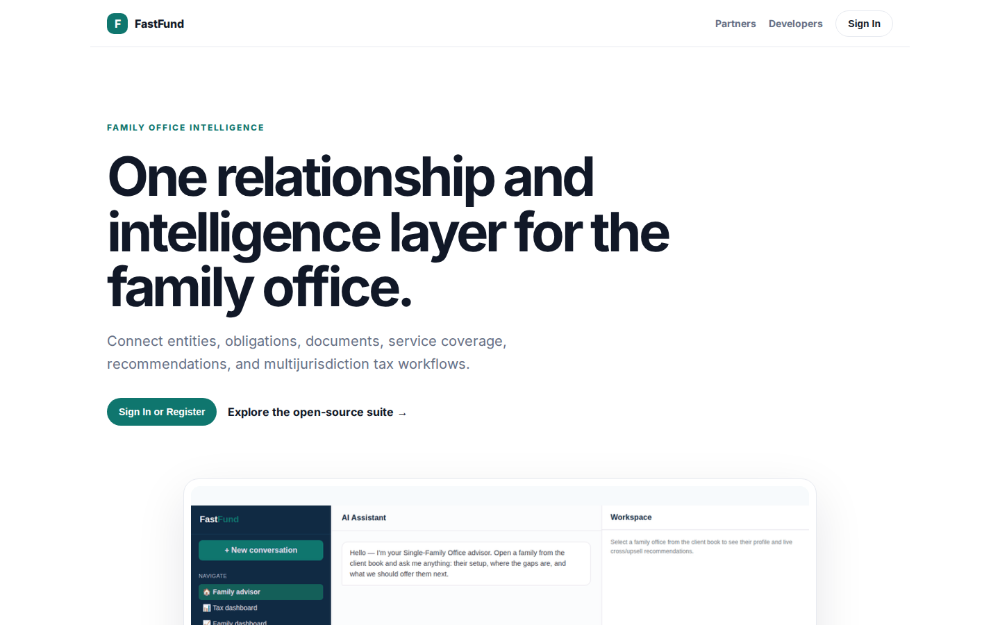
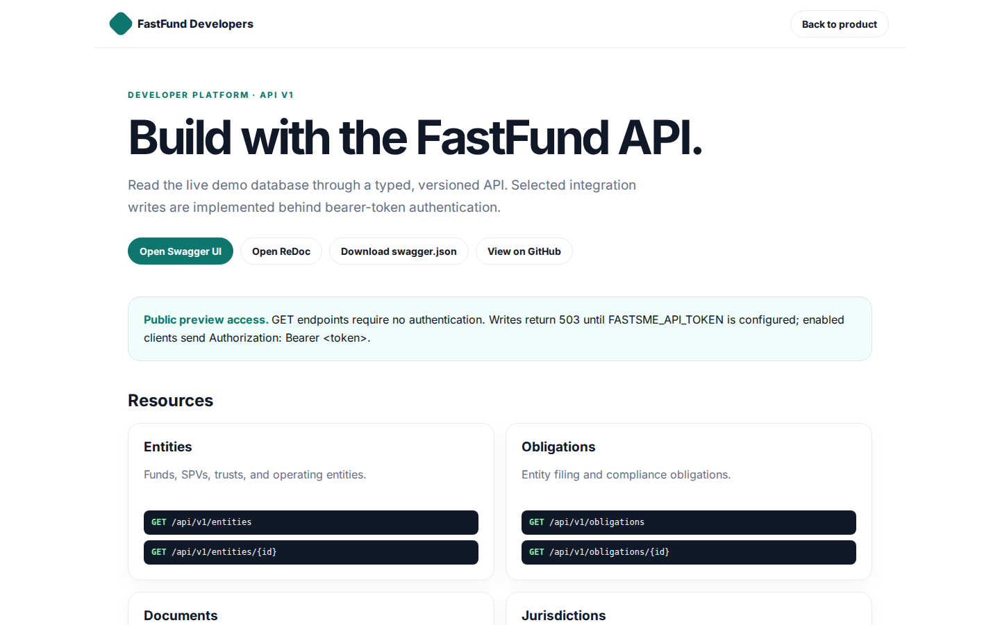

# FastFund Platform Guide

**Published:** 2026-08-19
**Platform:** [https://fund.fastsme.com](https://fund.fastsme.com)
**Source:** [github.com/predictivelabsai/FastFund](https://github.com/predictivelabsai/FastFund)

## Platform overview

Open-source family-office relationship management and multijurisdiction tax filing intelligence in one application.

This visual guide was reviewed against the live product using Playwright. Screens and available navigation can vary by account, role, and deployment configuration.

## 1. One relationship and intelligence layer for the family office.

FAMILY OFFICE INTELLIGENCE One relationship and intelligence layer for the family office. Connect entities, obligations, documents, service coverage, recommendations, and multijurisdiction tax workflows. Sign In or Register Explore the open-source suite → Prod

Screen reviewed at: [https://fund.fastsme.com/](https://fund.fastsme.com/)

## 2. Build with the FastFund API.

FastFund Developers Back to product DEVELOPER PLATFORM · API V1 Build with the FastFund API. Read the live demo database through a typed, versioned API. Selected integration writes are implemented behind bearer-token authentication. Open Swagger UI Open ReDoc

Screen reviewed at: [https://fund.fastsme.com/developers](https://fund.fastsme.com/developers)

## 3. Sign in

Sign in with Google Sign in to continue to fastsme.com Email or phone Forgot email? Next Create account Afrikaans azərbaycan bosanski català Čeština Cymraeg Dansk Deutsch eesti English (United Kingdom) English (United States) Español (España) Español (Latinoam

Screen reviewed at: [https://accounts.google.com/v3/signin/identifier?opparams=%253F&dsh=S-650794498%3A1787122743998414&client_id=887059023987-2a7spj1m82eivobdbt1itb3cqca6tpt1.apps.googleusercontent.com&nonce=fh0w0XpT1yr8uysLGYMt&o2v=2&redirect_uri=https%3A%2F%2Ffund.fastsme.com%2Fauth%2Fcallback&response_type=code&scope=openid+email+profile&service=lso&state=MrgL6u4QVtbES5YfERdC29qUwASgRa&flowName=GeneralOAuthLite&continue=https%3A%2F%2Faccounts.google.com%2Fsignin%2Foauth%2Flegacy%2Fconsent%3Fauthuser%3Dunknown%26part%3DAJi8hAMyvqZ-jgcAFAue3CMoJfLfbpSYHn6wU2XXdFpCIU8hfOQj3W1Aqc-B3J3pz3bTcIkq_RFXZeYhhonUaUlEMR3zq6687R0y6RpiOiT8FrC4G7FJCMfCtbNWDGs6cLk3RDBKBPtRpMm8BwyRjMFSKyL4W8rLDb1dnoKLVEM2bHx9axSlclOWK0y1wGmMKy75q5ixJkhOHTnB5YCgrN-whGpkcZ_XZ8cVHKIf4KKVqXBIR0o8f-xheA902m4ottdtGc-g16XsAYUVHXCxwPYn3ohO8pndn4Jb994KS0Lac6KsKXOjLa_mEmSbB8wgTN5nxKxdfhT_XkgG2ORjMu9s6yOaB8lFxzn8aJbREtt7mTp3Dx9-bpy59sJa--oY72YZTF7Pg3dFjEDngnB4yGSQ2T-Wjf4ddGk_2166vWXlopPbIFddrgVU8ehHSt-N7TNLcZwe3qpDys9aha6u_hwtOvQ3xmYk-A%26flowName%3DGeneralOAuthFlow%26as%3DS-650794498%253A1787122743998414%26client_id%3D887059023987-2a7spj1m82eivobdbt1itb3cqca6tpt1.apps.googleusercontent.com%23&app_domain=https%3A%2F%2Ffund.fastsme.com&rart=ANgoxcdXOf7AHoEQOMOnlnghhS4mYgTj4zkOgKFAZH-yPl216QIrriLUwtxMSyj0mmsej56osridIg0O2hN-OhYi5G85cxsi4lMOAMv-17wQn7D8o8NZDY0](https://accounts.google.com/v3/signin/identifier?opparams=%253F&dsh=S-650794498%3A1787122743998414&client_id=887059023987-2a7spj1m82eivobdbt1itb3cqca6tpt1.apps.googleusercontent.com&nonce=fh0w0XpT1yr8uysLGYMt&o2v=2&redirect_uri=https%3A%2F%2Ffund.fastsme.com%2Fauth%2Fcallback&response_type=code&scope=openid+email+profile&service=lso&state=MrgL6u4QVtbES5YfERdC29qUwASgRa&flowName=GeneralOAuthLite&continue=https%3A%2F%2Faccounts.google.com%2Fsignin%2Foauth%2Flegacy%2Fconsent%3Fauthuser%3Dunknown%26part%3DAJi8hAMyvqZ-jgcAFAue3CMoJfLfbpSYHn6wU2XXdFpCIU8hfOQj3W1Aqc-B3J3pz3bTcIkq_RFXZeYhhonUaUlEMR3zq6687R0y6RpiOiT8FrC4G7FJCMfCtbNWDGs6cLk3RDBKBPtRpMm8BwyRjMFSKyL4W8rLDb1dnoKLVEM2bHx9axSlclOWK0y1wGmMKy75q5ixJkhOHTnB5YCgrN-whGpkcZ_XZ8cVHKIf4KKVqXBIR0o8f-xheA902m4ottdtGc-g16XsAYUVHXCxwPYn3ohO8pndn4Jb994KS0Lac6KsKXOjLa_mEmSbB8wgTN5nxKxdfhT_XkgG2ORjMu9s6yOaB8lFxzn8aJbREtt7mTp3Dx9-bpy59sJa--oY72YZTF7Pg3dFjEDngnB4yGSQ2T-Wjf4ddGk_2166vWXlopPbIFddrgVU8ehHSt-N7TNLcZwe3qpDys9aha6u_hwtOvQ3xmYk-A%26flowName%3DGeneralOAuthFlow%26as%3DS-650794498%253A1787122743998414%26client_id%3D887059023987-2a7spj1m82eivobdbt1itb3cqca6tpt1.apps.googleusercontent.com%23&app_domain=https%3A%2F%2Ffund.fastsme.com&rart=ANgoxcdXOf7AHoEQOMOnlnghhS4mYgTj4zkOgKFAZH-yPl216QIrriLUwtxMSyj0mmsej56osridIg0O2hN-OhYi5G85cxsi4lMOAMv-17wQn7D8o8NZDY0)

## Getting started

Visit [https://fund.fastsme.com](https://fund.fastsme.com) to explore FastFund. For source code and deployment details, use the GitHub link above.
