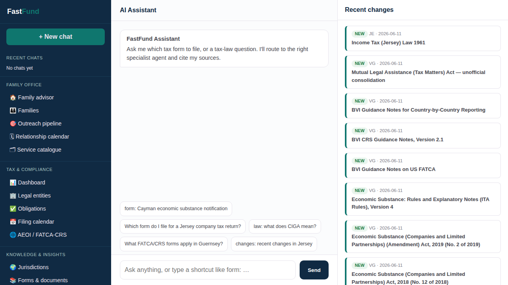
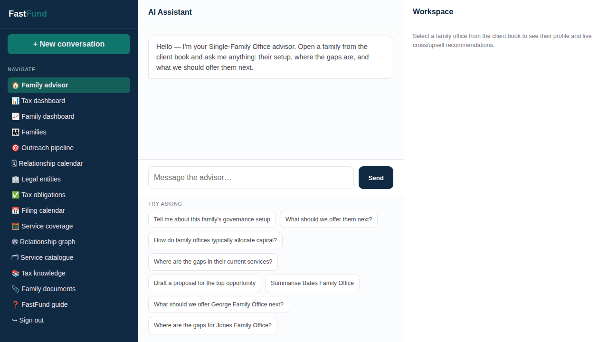
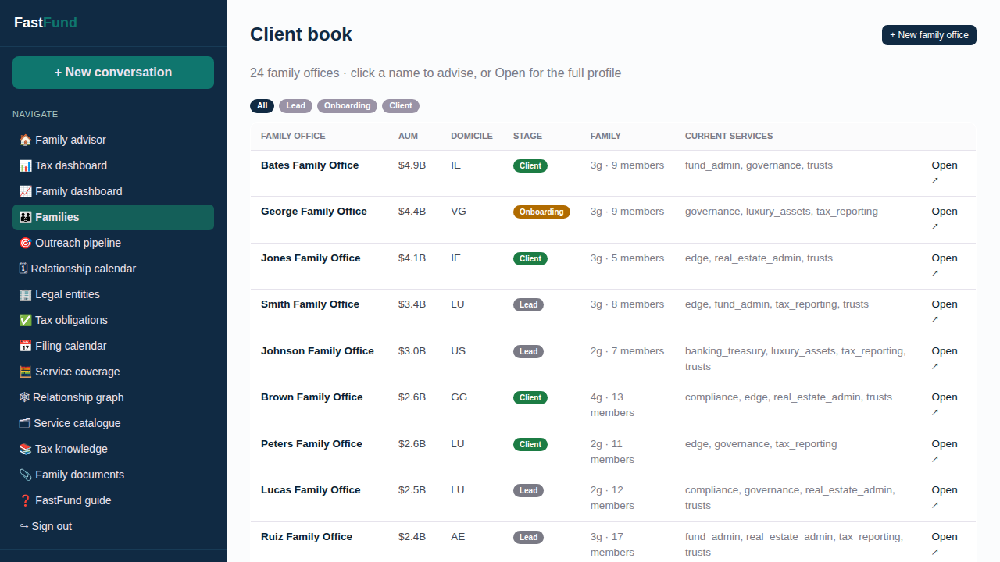
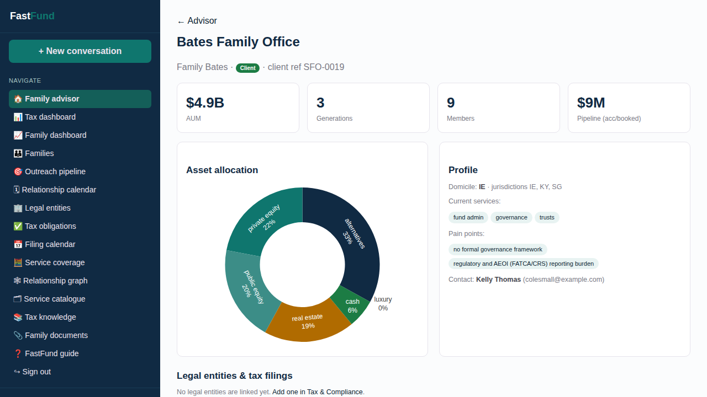
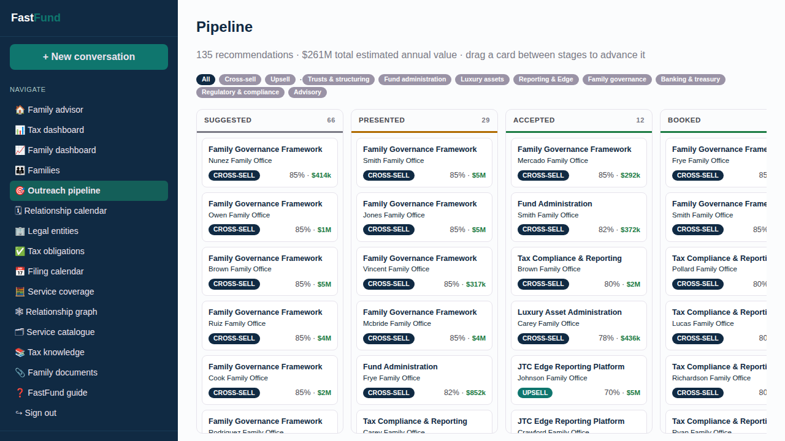
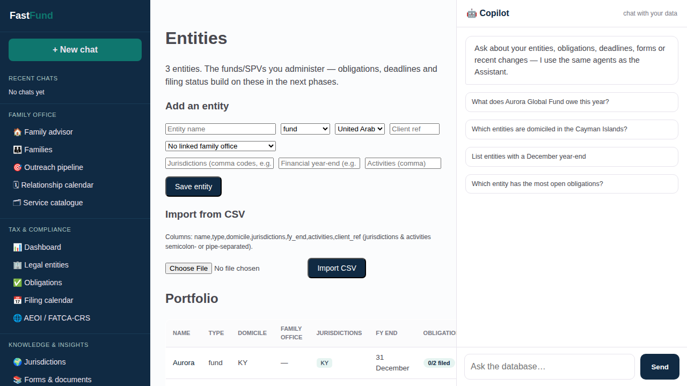
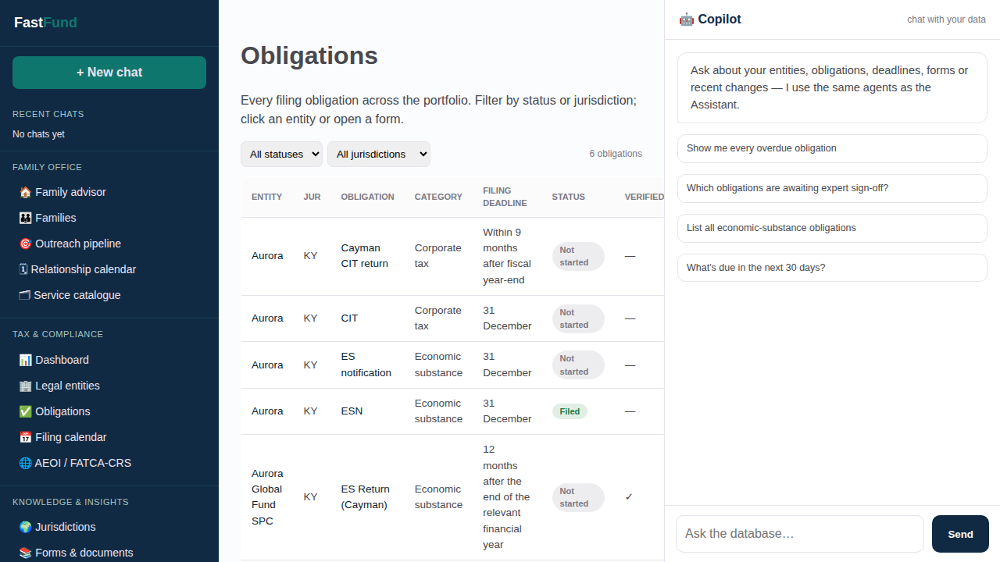
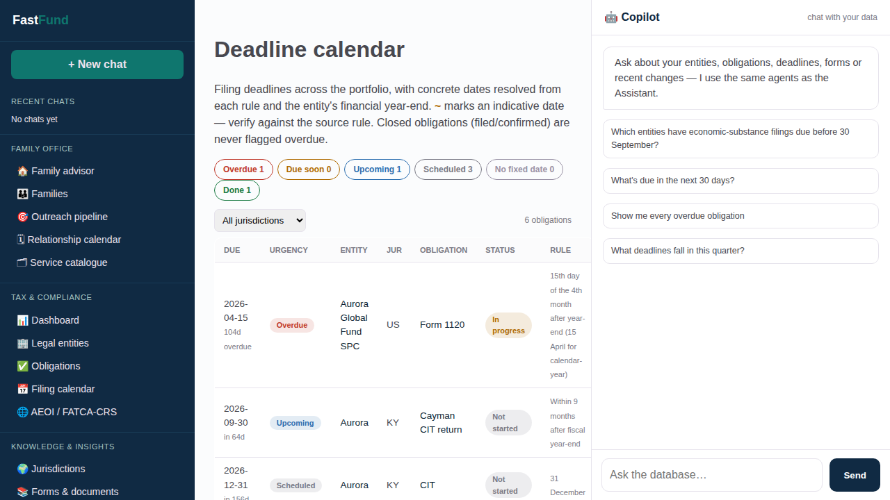
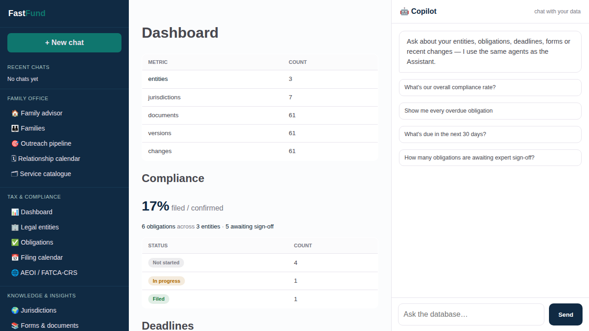

# FastFund User Guide

FastFund combines family-office relationship outreach with multijurisdiction tax filing intelligence in one open-source product.

## One connected operating journey

- Onboard a family office and capture principals, portfolio context and service needs.
- Develop explainable outreach opportunities, proposals and relationship actions.
- Link every fund, trust, company, SPV and holding vehicle to its owning family.
- Determine jurisdiction-specific obligations, deadlines and filing readiness.
- Prepare, review, file and verify while monitoring changes in source law.

## FastFund assistant

- A shared assistant routes questions to tax-law, form, change and data specialists.
- The rationalised sidebar groups work into Family Office, Tax & Compliance, and Knowledge & Insights.
- Answers remain grounded in official source material and linked operational data.

## Family-office advisor

- Ask about a family's governance, service gaps, portfolio or next best action.
- Rules and the cross-sell graph produce traceable recommendations.
- The profile and live recommendations stay visible beside the conversation.

## Families and outreach book

- Manage leads, onboarding relationships and established family-office clients.
- Review AUM, domicile, generations, family size and services already held.
- Open any family directly in the advisor or its complete relationship profile.

## Family profile and ownership

- Portfolio allocation, holdings, transactions, members and relationship history in one view.
- Outreach recommendations and scheduled actions share the same family context.
- Linked legal entities connect relationship work directly to tax filings.

## Outreach pipeline

- Move recommendations through suggested, presented, accepted and booked stages.
- Filter cross-sell and upsell opportunities by service category.
- Generate proposals and schedule consultations or follow-ups.

## Legal entities

- Funds, trusts, companies, GPs, SPVs and holding vehicles share one portfolio.
- Each entity can be linked to its owning family office.
- Jurisdictions, activities and financial year-end drive deterministic filing obligations.

## Filing obligations

- Track every filing from determination through preparation, filing and confirmation.
- Statuses and expert verification survive repeat determination runs.
- Filter by jurisdiction, category, urgency, entity and completion state.

## Multijurisdiction filing calendar

- Resolve form rules into real deadlines using the entity's financial year-end.
- Urgency indicators surface overdue, due-soon and upcoming work.
- Calendar and register views provide operational and portfolio-level perspectives.

## Tax and compliance dashboard

- See entities, open obligations, filed work and verification coverage at a glance.
- Move from portfolio metrics directly to the records behind them.
- Use audit, team and assistant analytics for controlled operations.

## Knowledge, provenance and regulatory change

- Official forms, legislation, guidance, gazettes and treaties are captured by jurisdiction.
- Immutable versions and change records preserve the regulatory audit trail.
- Citations and provenance edges connect answers and forms back to source law.
- SQLite supports zero-infrastructure use; Neo4j adds native graph traversal.

## Human-controlled automation

- FastFund assists with research, determination, preparation and outreach.
- Users review recommendations, validate form readiness and confirm filing status.
- Synthetic demo data is used for family-office examples; official tax sources retain provenance.
