# SFO Hub — User Guide

AI relationship-manager for JTC Private Office: a cross-sell & upsell advisor for single family offices. A slide version is at [`sfohub_user_guide_2026-06-22.pdf`](sfohub_user_guide_2026-06-22.pdf).

## The advisor workspace

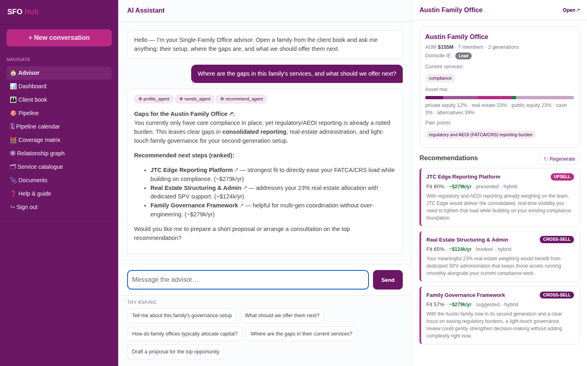

- Three panes: client book + navigation (left), the AI advisor (centre), and the open family's profile + live recommendations (right).
- Ask in plain English — the advisor routes your question to specialist agents and answers with citations and open-in-panel links.
- Suggestion chips below the box get you started.

## Client book

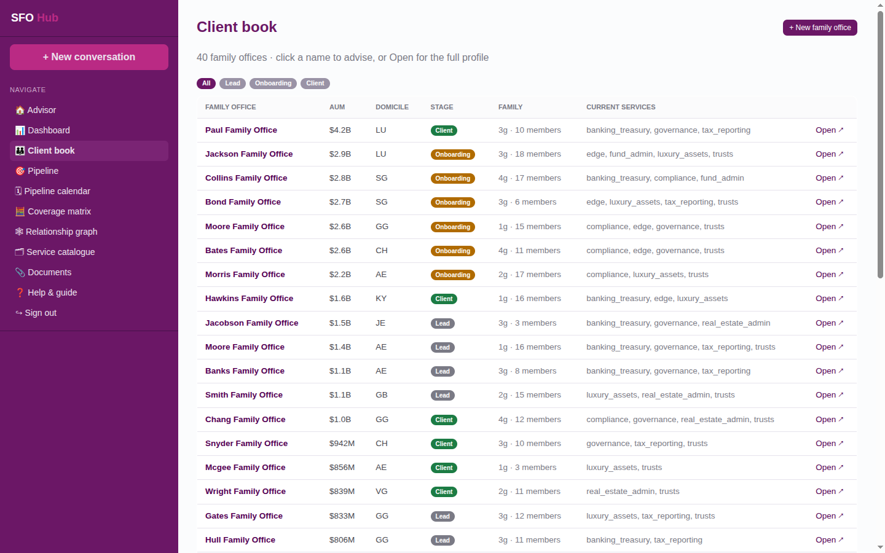

- Every family office in one filterable table — AUM, domicile, stage, family, current services.
- Filter by lifecycle stage (lead · onboarding · client).
- Click a name to advise on them; ‘Open’ for the full profile; ‘+ New family office’ to onboard a lead.

## Family profile

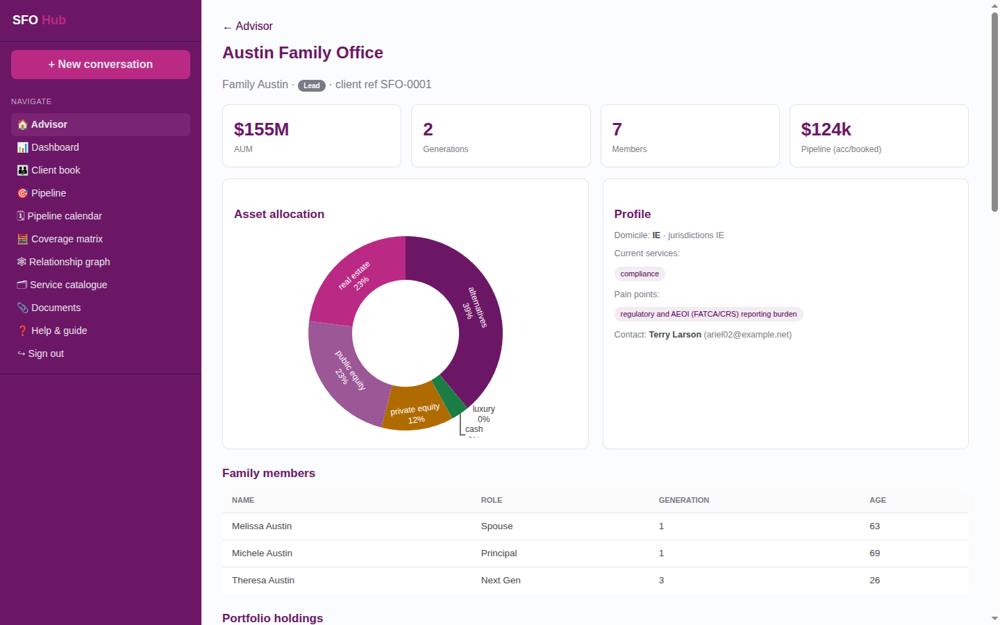

- AUM, generations, family size and the accepted/booked pipeline at a glance.
- Asset-allocation donut, current services, jurisdictions and pain points.
- Family members and full history in one place.

## Portfolio & transactions

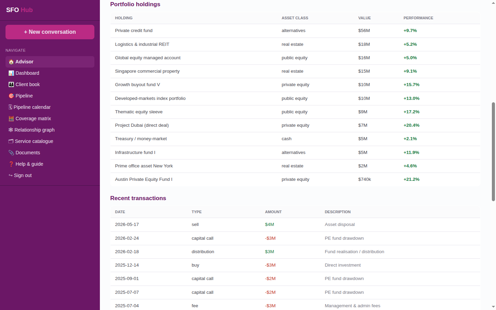

- Mock holdings across PE, real estate, public equity, luxury, cash and alternatives — each with a performance figure.
- Recent cash-flow transactions: capital calls, distributions, buys, fees.
- Drives the ‘personalised insights’ the advisor reasons over.

## Pipeline (kanban)

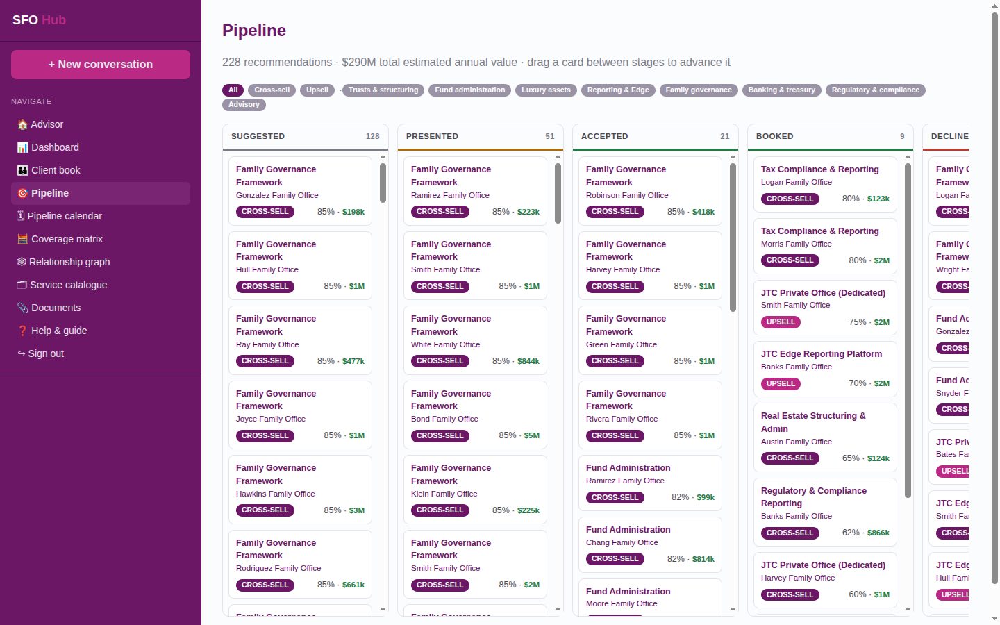

- Every recommendation as a card, grouped by funnel stage: suggested → presented → accepted → booked (or declined).
- Drag a card between columns to advance it — status persists instantly.
- Filter by cross-sell / upsell or by service category.

## Pipeline calendar

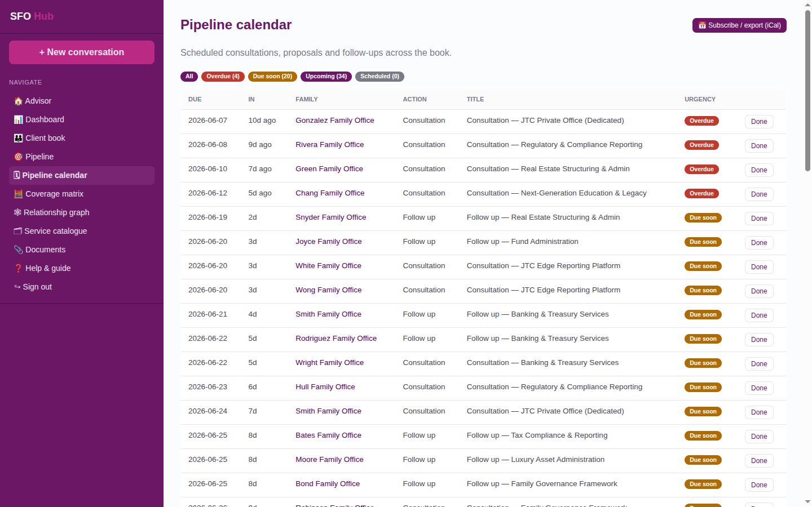

- Scheduled consultations, proposals and follow-ups across the book.
- Urgency-coded (overdue · due soon · upcoming) and filterable.
- Export to your own calendar with the iCal (.ics) button.

## Coverage matrix

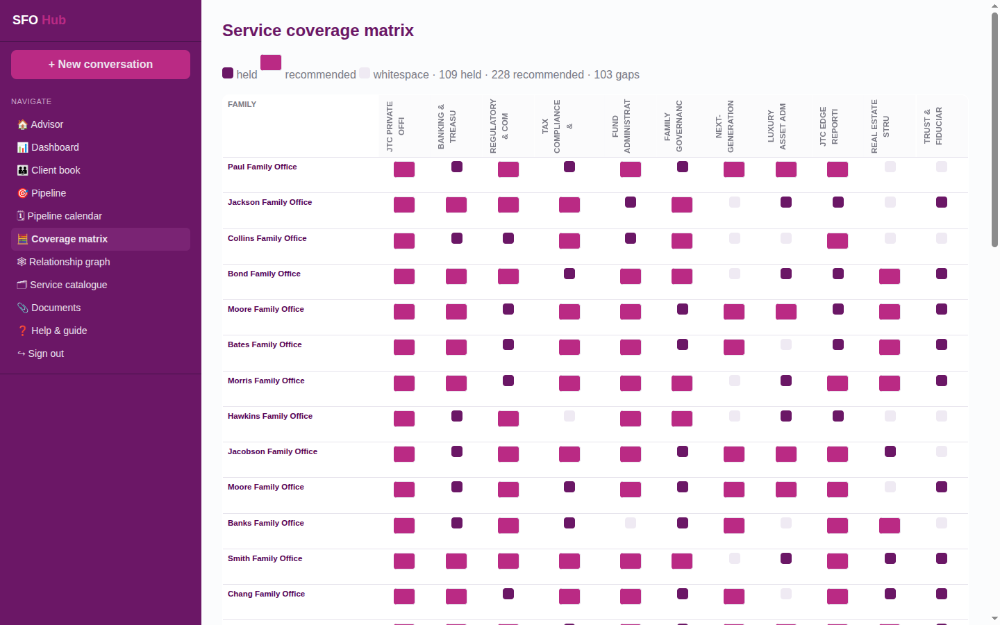

- A family × service grid: held, recommended, or whitespace at a glance.
- Spot cross-sell opportunities across the whole book in one view.
- Click a family to jump to the advisor.

## Relationship graph

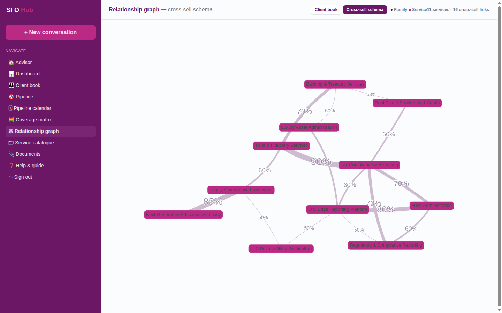

- Two modes: the cross-sell schema (how services bundle, with weights) and the client book (families ↔ the services they hold and are offered).
- Click a node to open the service or the family.
- The cross-sell graph is what the engine traverses to find bundles.

## Analytics dashboard

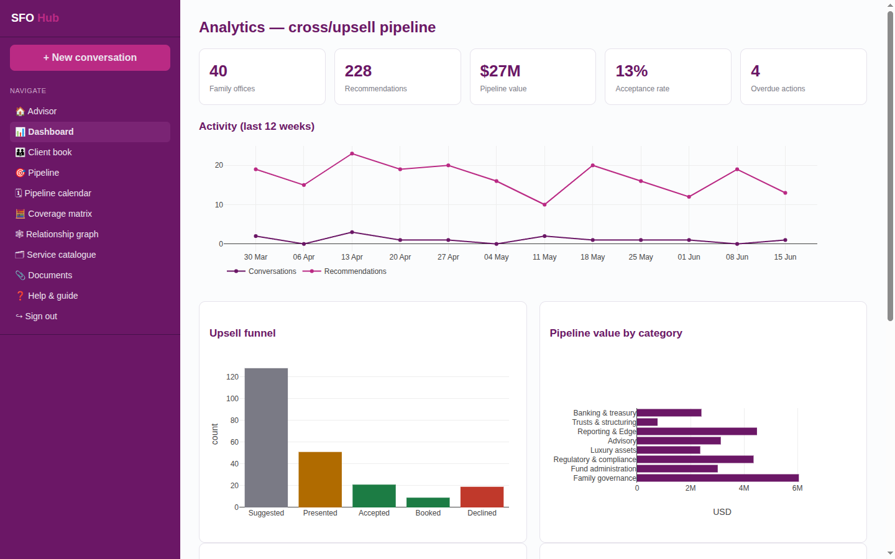

- Top line: family offices, recommendations, pipeline value, acceptance rate.
- Upsell funnel, pipeline value by category, average allocation, interest heatmap.
- Activity trends — conversations and recommendations over the last 12 weeks.

## Documents & insights

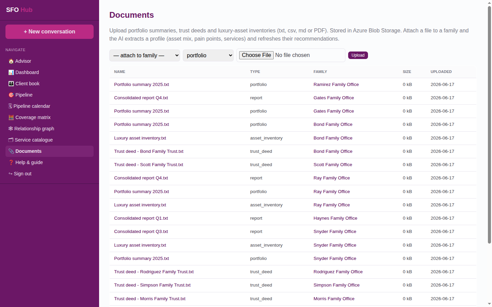

- Upload portfolio summaries, trust deeds and inventories (txt, csv, md, PDF).
- Attach to a family and the AI extracts a profile — asset mix, pain points, services in place — and refreshes their recommendations.
- Stored in Azure Blob Storage.

## Onboard a new lead

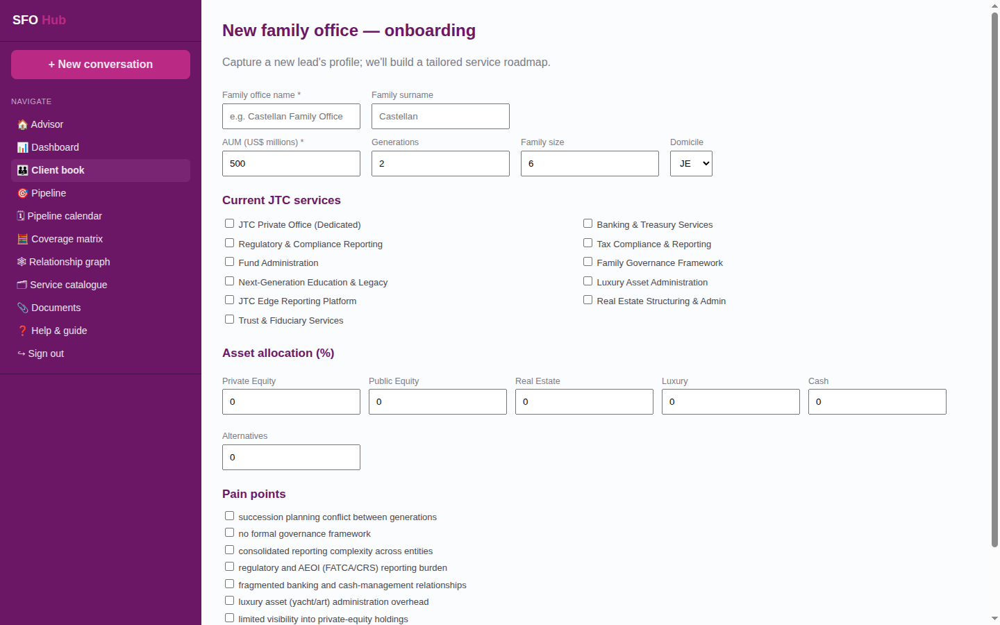

- Capture a prospect's profile through a guided intake form.
- We create the lead and immediately produce a tailored service roadmap.
- The new family appears in the client book, ready to advise.

## Service catalogue

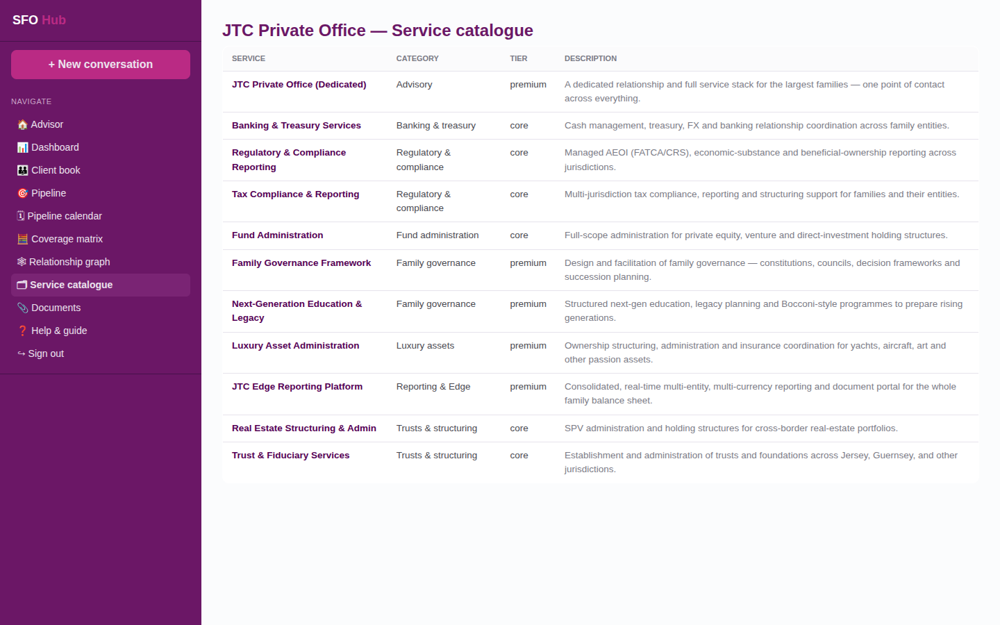

- The JTC Private Office offerings the advisor cross-sells and upsells.
- Each service shows its category, tier and description.
- Open a service to see common bundles and which families hold it.

## How recommendations are made

- A transparent rule catalogue fires on the profile (services, asset mix, pain points, AUM, stage).
- The cross-sell graph expands the candidate set; an AI layer re-ranks and rewrites each rationale in a relationship-manager voice.
- Every recommendation is traceable to the rule or graph edge behind it.
- All family-office data is synthetic — no real client data is used.
