# TaxHub — User Guide

Tax-law traceability & filing intelligence for fund back-office: ask in plain English and every answer cites the source law. A slide version is at [`taxhub_user_guide.pdf`](taxhub_user_guide.pdf).

## A typical journey — from onboarding to filed

- <b>1 · Onboard the book.</b> Add or CSV-import the funds, SPVs, GPs and trusts you administer — each with its domicile, operating jurisdictions, financial year-end and activities.
- <b>2 · Determine what's owed.</b> One click matches each entity to the expert-curated forms catalogue and generates its filing obligations — deterministically, with no guesswork.
- <b>3 · See the deadlines.</b> The calendar resolves every rule into a real date from the entity's year-end, flagging what's overdue or due soon.
- <b>4 · Check AEOI readiness.</b> The FATCA / CRS dashboard classifies each entity and validates its W-8s, GIIN and controlling persons before any return is filed.
- <b>5 · Let the agent prepare the form.</b> Ask the assistant to fill a W-8BEN-E; it fills in live, validates each field, and you edit and sign off.
- <b>6 · File, verify and stay current.</b> Mark obligations filed and sign them off, while the changes feed and cited tax-law answers keep you ahead.

## The Assistant workspace

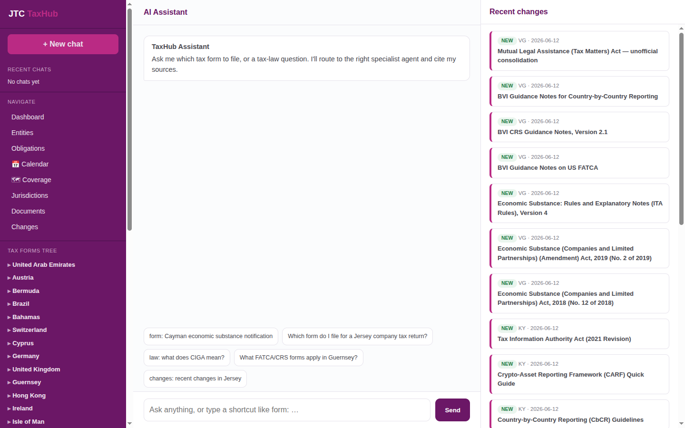

- Three panes: navigation + forms tree + shortcuts (left), the AI assistant (centre), and a live regulatory-changes feed (right).
- Ask in plain English — it routes to the right specialist agent (form-finder, tax-law, changes, free search) and answers with citations.
- Suggestion chips and `shortcut:` prefixes get you started fast.

## Compliance dashboard

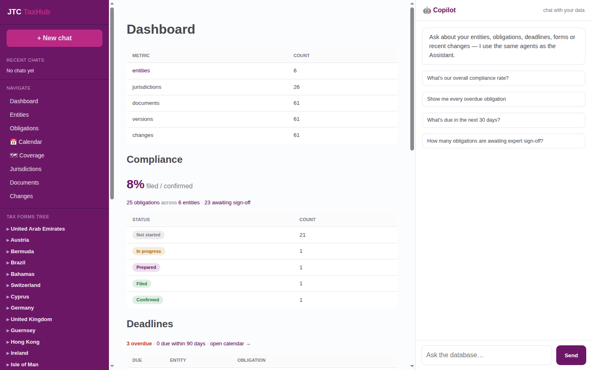

- The whole book at a glance: obligations across all entities, how many are filed, and how many await expert sign-off.
- An overdue / due-soon digest surfaces what needs attention now.
- Every figure links straight through to the underlying list.

## Entities portfolio

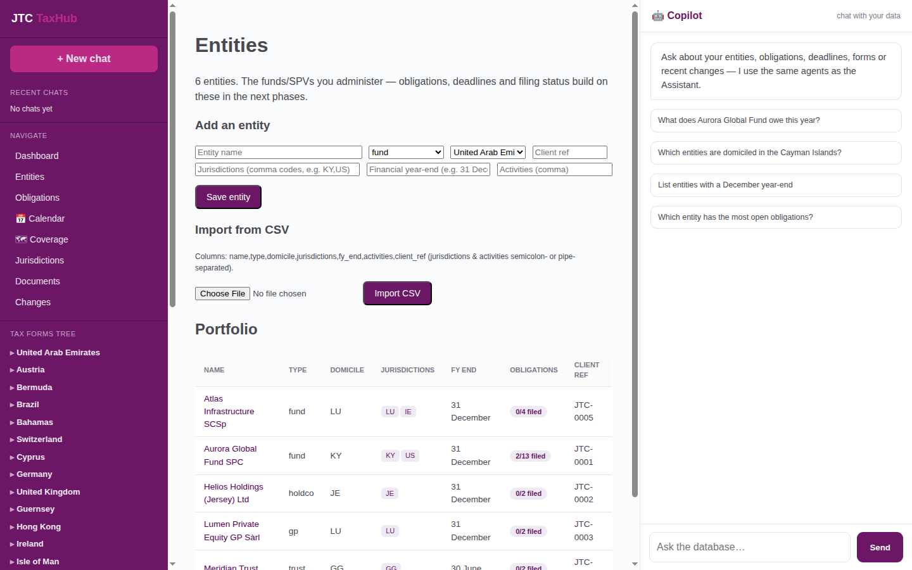

- Every fund, SPV, GP, trust and holdco you administer in one table — type, domicile, jurisdictions, financial year-end and filing ratio.
- Add an entity inline, or bulk-import the portfolio from CSV.
- Each entity's obligations and deadlines build on this record.

## Entity profile

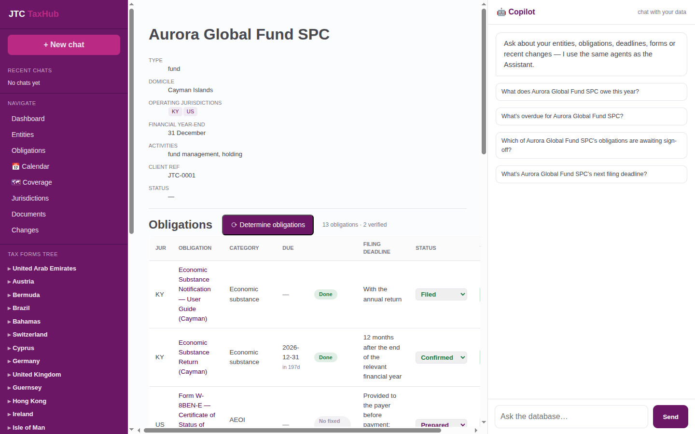

- A single entity's full picture — domicile, jurisdictions, year-end and client reference.
- Its complete obligation register with filing status and deadlines.
- The starting point the Assistant reasons over for entity questions.

## Obligations register

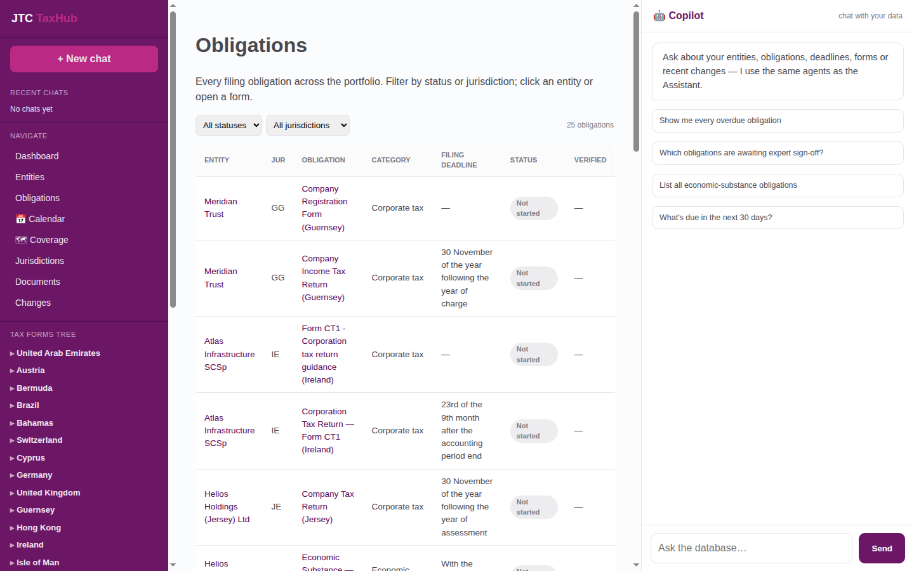

- Every filing obligation across the book — entity, jurisdiction, type, deadline and status.
- Track what's filed, confirmed, or still awaiting expert sign-off.
- Filter to economic-substance, CRS/FATCA, returns and more.

## Filing calendar

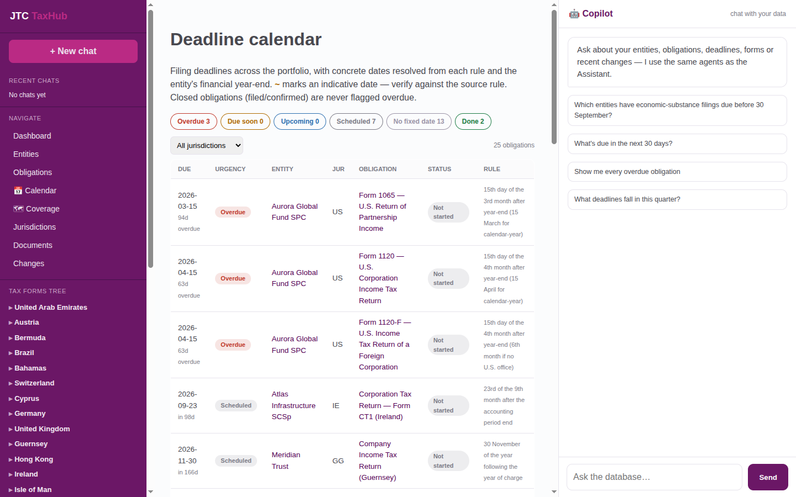

- All deadlines on one timeline, urgency-coded: overdue, due soon, upcoming.
- Filter by entity, jurisdiction or obligation type.
- Resolves real due-dates from each entity's year-end and the rules.

## Coverage map

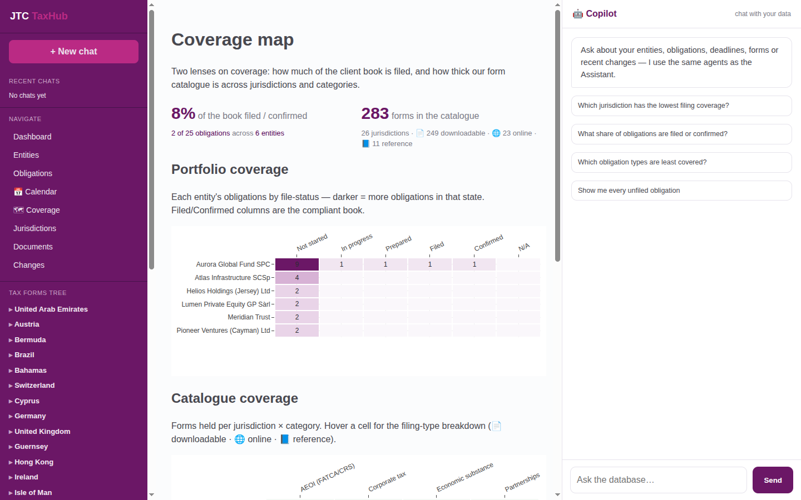

- A jurisdiction × obligation grid showing filed / confirmed coverage at a glance.
- Spot gaps — where an obligation exists but nothing has been filed yet.
- Drill from any cell into the obligations behind it.

## Jurisdictions

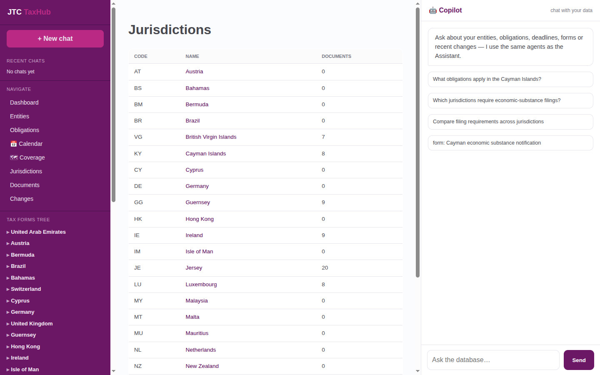

- The jurisdictions you operate in, each with its filing requirements.
- Open one to see the obligations, forms and source law that apply.
- Backed by a live-scraped corpus across 26 jurisdictions.

## Document library

- Every source document — acts, guidance notes, circulars and forms.
- Full-text searchable; each is the provenance behind an answer.
- Open a document to read it with its version history.

## Regulatory changes

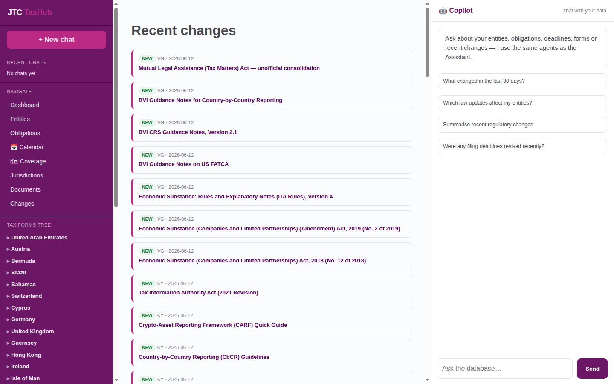

- A running feed of what changed in the law, newest first, by jurisdiction.
- Each change links to the document version that introduced it.
- The same feed powers the `changes:` shortcut in the Assistant.

## Document hierarchy

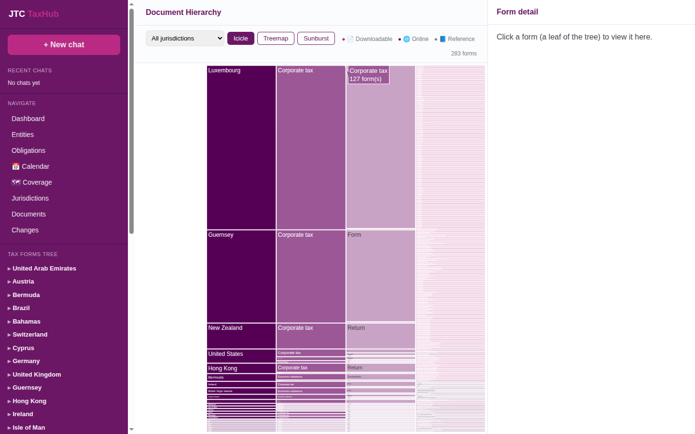

- A tree view of the corpus: jurisdiction → document → version.
- See how the law is structured before you dive into the text.
- Click through to any document in context.

## Ontology graph

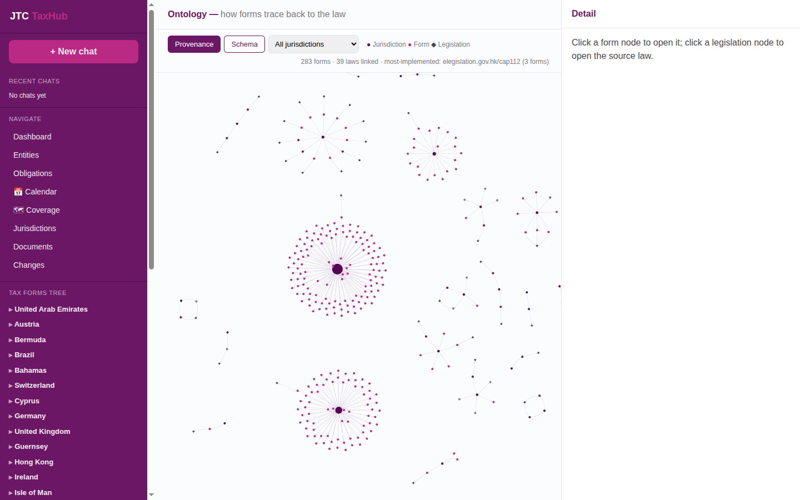

- A force-directed graph of how forms trace back to the law (283 forms, 39 laws linked).
- Toggle between the Provenance view and the Schema view.
- Click a form to open it, or a legislation node to open the source law.

## Cited tax-law answers

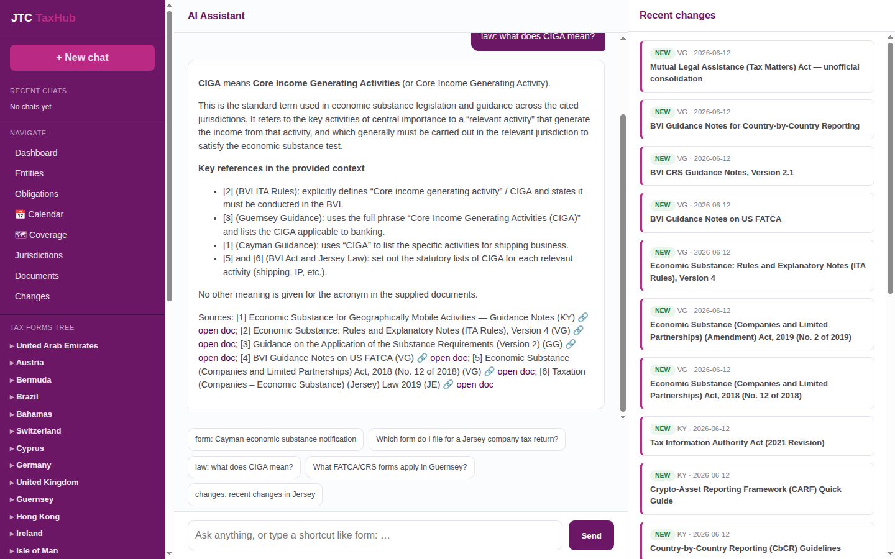

- Ask a tax-law question and the Assistant answers from the corpus — never from thin air.
- Every claim carries a numbered citation, with open-doc links to the source.
- Here: 'what does CIGA mean?' → Core Income Generating Activities, sourced.

## Form finder

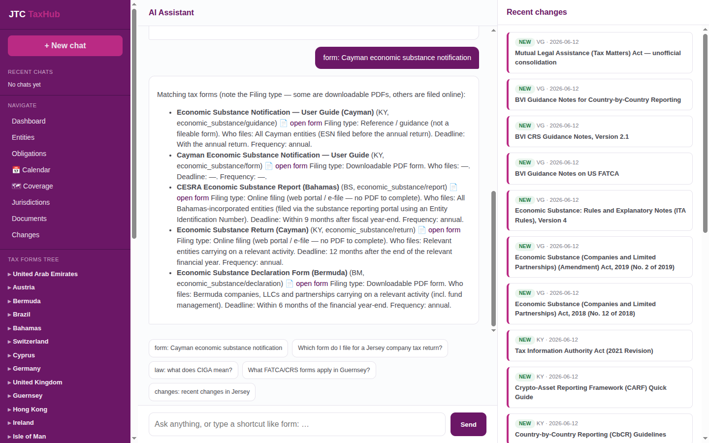

- Describe what you need to file; the form-finder ranks the matching forms.
- Each result shows the filing type (downloadable PDF vs online portal), who files, the deadline and the frequency.
- Open any form straight from the answer.

## AEOI readiness · FATCA / CRS

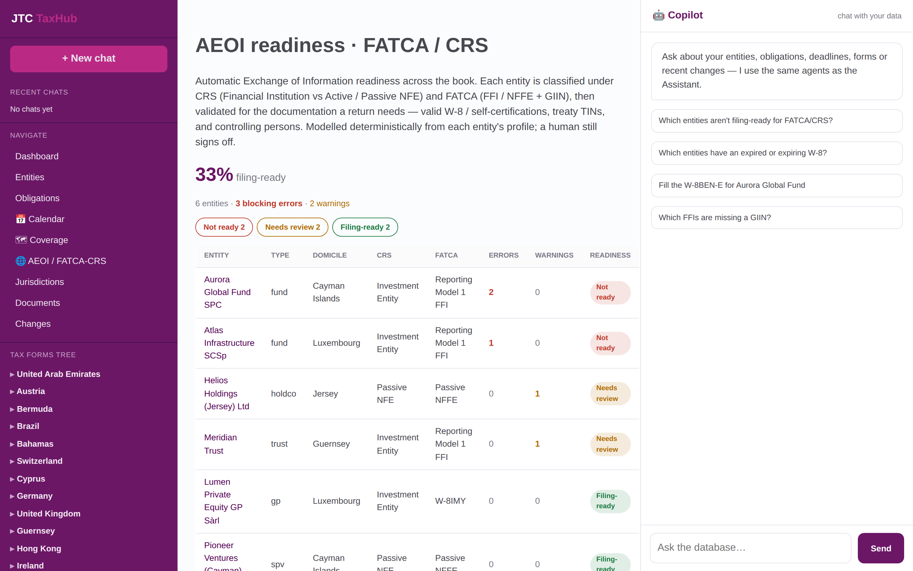

- Every entity is classified under CRS (Financial Institution vs Active / Passive NFE) and FATCA (FFI / NFFE + GIIN) — derived from its own profile.
- Validated for the documentation a return needs: a valid W-8 / self-certification, a treaty TIN, a GIIN, and identified controlling persons.
- A filing-ready / needs-review / not-ready verdict per entity, with the exact blocking issue and how to fix it — CRS 3.0 checks built in.

## Agent auto-fills a W-8BEN-E

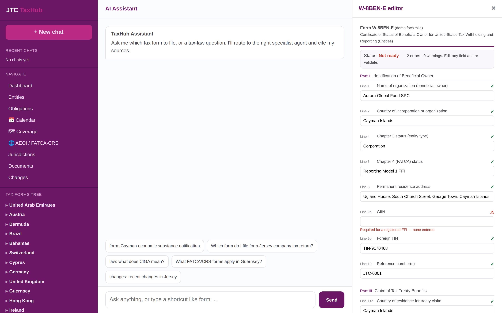

- Ask the assistant to prepare a W-8BEN-E for an entity; the form opens on the right and fills in live from everything TaxHub already knows.
- Each field is validated as it lands — here the missing GIIN for a Reporting Model 1 FFI is flagged in red and the form is marked Not ready.
- Edit any field, re-validate, then sign off — the human-in-the-loop guardrail. A conceptual demo of agent-assisted form completion.

## How it works

- A live-scraped corpus of tax law across 26 jurisdictions, stored as a graph (documents → versions → changes → citations) in Neo4j.
- Specialist agents retrieve over that graph (vector + hybrid) and an LLM writes the answer — always grounded in, and citing, the source.
- Entities, obligations and deadlines sit on top, so the same corpus answers both 'what's the law?' and 'what do I owe, and when?'.
