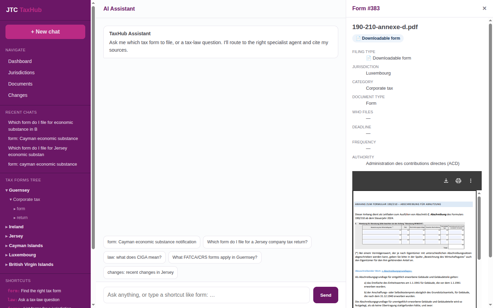
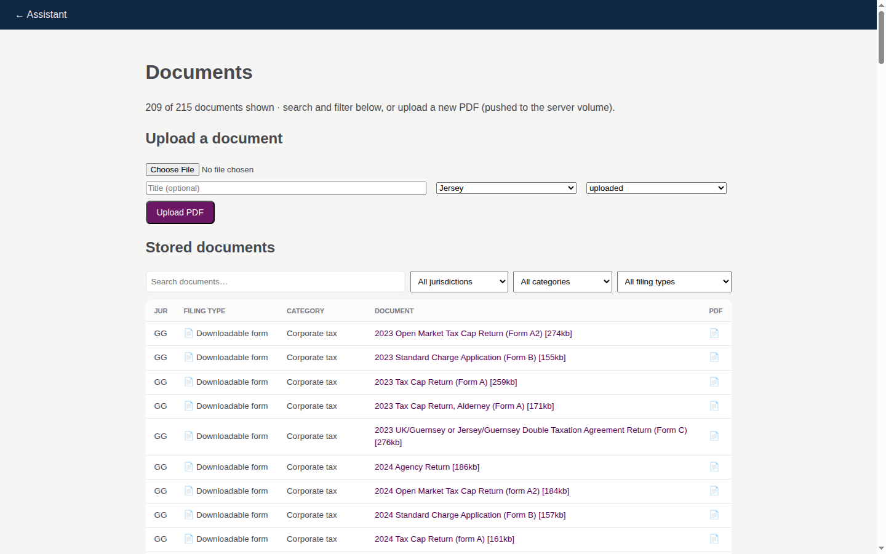

# JTC TaxHub — User Guide

**TaxHub** · Tax-form finder & traceability for the fund back office
**Version 2 · June 2026 · Confidential — Internal Use Only**
Deployed at **taxhub.predictivelabs.ai**

---

[TOC]

---

## 1. Overview

TaxHub helps a fund-management back office answer one question fast: **"which tax
form do I need to file, and where?"** — and then traces that form back to the
**underlying legislation**.

It combines three things:

- A **form-finder corpus** — tax forms scraped from official revenue authorities
  across JTC's fund domiciles, classified by jurisdiction, category and filing type.
- An **AI Assistant** — a LangGraph orchestrator (xAI Grok) that routes your
  question to the right specialist agent and answers with cited sources.
- A **legislation/provenance layer** — the primary law each form implements, kept
  as links so answers are traceable, not just plausible.

---

## 2. What it does

- **Finds the right form** for a described need (e.g. *"Cayman economic substance
  notification"*) and opens it in the viewer.
- **Answers tax-law questions** (e.g. *"what does CIGA mean?"*) with citations to
  the tracked legislation/guidance corpus.
- **Tracks changes** — every tracked document is versioned; amendments get a
  plain-English AI summary.
- **Stores and serves PDFs** — forms are stored on the server and viewable inline;
  online-filed forms link out to the official portal.

---

## 3. Filing types

The most important label on every form is **how it is filed**:

| Filing type | Meaning |
|-------------|---------|
| 📄 **Downloadable form** | A PDF you complete and submit. |
| 🌐 **Online filing** | Filed via a web portal / e-file — there is no PDF to complete; the record links to the portal. |
| 📘 **Reference / guidance** | A user guide or guidance note — *not* a fileable form. |

This distinction is shown in the Assistant's answers, on each form's detail panel,
and as a filter in the Documents browser.

---

## 4. Coverage audit — what each authority actually offers

Not every jurisdiction publishes downloadable forms; several require online
filing and publish only guidance. TaxHub captures this honestly:

| Jurisdiction | How you actually file | What the site offers | filing_type |
|--------------|-----------------------|----------------------|-------------|
| **Luxembourg** (ACD) | Complete & submit PDF | 126 real fillable forms (200/300/500/710…) | downloadable |
| **Guernsey** (gov.gg) | PDF forms (main return online) | 71 real forms (registration, tax-cap returns…) | downloadable |
| **Jersey** (Revenue Jersey) | Online portal | No downloadable form | online |
| **Ireland** (Revenue) | ROS e-file | PDFs are TDM guidance, not forms | online + reference |
| **Cayman** (DITC) | DITC portal | PDFs are user guides | online + reference |
| **BVI** (ITA) | BOSS portal (via agent) | PDFs are guidance/methodology | online + reference |

---

## 5. Using the AI Assistant

The centre pane is a streaming chat. Ask in plain English; the **orchestrator**
routes to a specialist agent and streams the answer with the agent shown working:

- **DocumentAgent** — finds the correct tax form(s) for a need.
- **LawAgent** — answers tax-law questions over the legislation corpus (graph-RAG).
- **MetadataAgent** — lists forms / deadlines for a jurisdiction or category.
- **ChangesAgent** — reports recent changes to tracked documents.

Answers keep `[form:N]` / `[doc:N]` markers — click them to open the form PDF or
source document in the right pane. **Suggestion cards** under the input offer
starting points.

---

## 6. Shortcuts

Type a prefix in the chat box to go straight to a capability:

| Shortcut | Does |
|----------|------|
| `form:` | Find the right tax form for a need |
| `law:` | Ask a tax-law question (graph-RAG) |
| `forms:` | List forms for a jurisdiction (e.g. `forms: KY`) |
| `changes:` | Recent changes (optionally by jurisdiction) |
| `find:` | Free search of the corpus |

---

## 7. The Forms Tree

The left pane shows a navigable taxonomy:

**Jurisdiction → category → document type → form**

Categories include corporate tax, economic substance, AEOI (FATCA/CRS),
beneficial ownership, partnerships, and fund-specific. Drill down and click a
form to open it.

---

## 8. Documents & upload

The **Documents** page lists every stored-PDF document with **search and
jurisdiction / category / filing-type filters**. It also has an **upload form**:
drop a PDF, set jurisdiction + category, and it is pushed to the server volume
and registered — useful for adding forms without server access.

Clicking a document opens it in the PDF viewer (right pane); online-filed forms
link to the official portal instead.

---

## 9. Provenance & traceability

Forms are the primary corpus; **legislation is linked, not duplicated**. Each
form carries a `legislation_ref` to the law it implements, shown as
*"Underlying law"* on the form panel. The LawAgent answers over the tracked
legislation/guidance corpus (`(:Document)` nodes) and cites its sources, so every
answer can be traced back to the official text.

---

## 10. Roadmap

- **PDF highlight & provenance** — pdf.js viewer that jumps to and highlights the
  cited passage.
- **Wider jurisdiction coverage** — extend the scraper pattern to all JTC domiciles
  (Isle of Man, Mauritius, Netherlands, Switzerland, Singapore, Hong Kong, USA,
  UK, South Africa, UAE).
- **Change digest & alerts** — scheduled per-jurisdiction summaries of what moved.

---

*JTC TaxHub · built on FastHTML, Neo4j AuraDB, and xAI Grok.*
