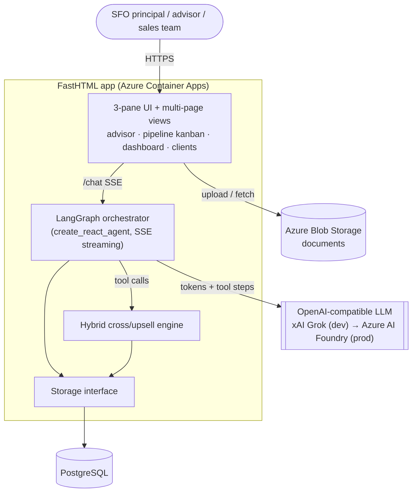
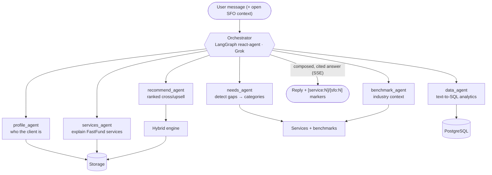
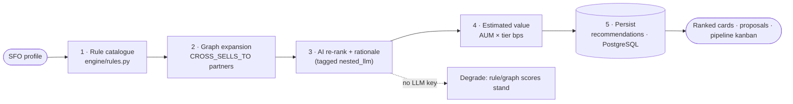
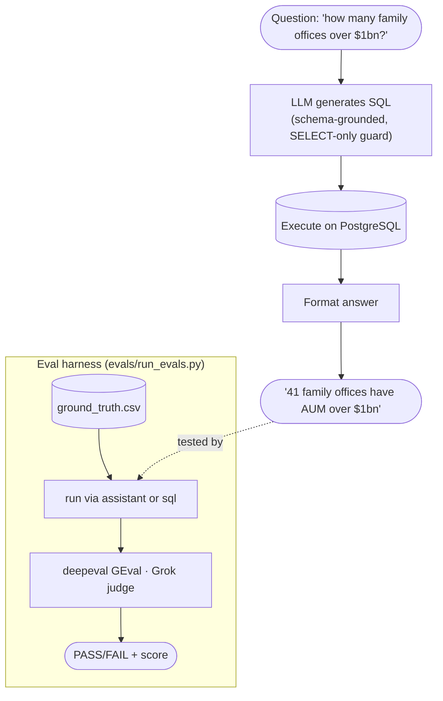
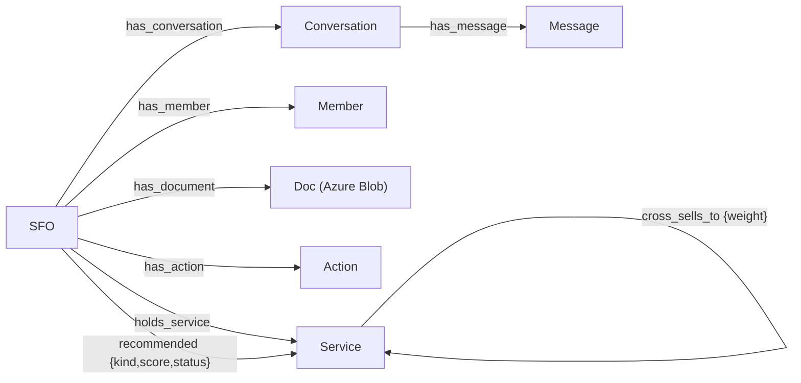
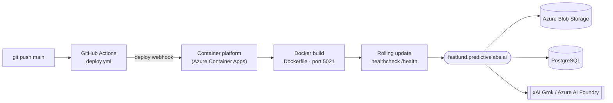
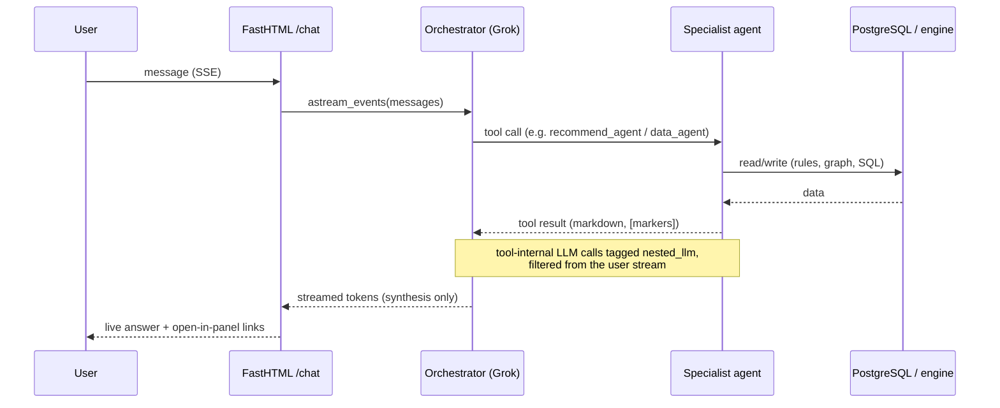

# FastFund — Technical Architecture (Agentic)

The AI conversational advisor for cross-selling/upselling to single family offices
(SFOs). This document describes the **agentic architecture**: the LangGraph
orchestrator, its specialist agents, the hybrid recommendation engine, the
text-to-SQL data agent, and how the whole system is wired and deployed.

The platform standardises on **PostgreSQL** for data and **Azure Blob Storage**
for documents. Rendered diagrams live in [`docs/diagrams/`](diagrams/); a slide
deck is at [`docs/technical_architecture_slides.pdf`](technical_architecture_slides.pdf).

---

## 1. System overview

A single FastHTML app serves the 3-pane advisor UI and routes every chat message
to a LangGraph tool-calling orchestrator. The orchestrator calls specialist
agents, which read/write **PostgreSQL** and call an OpenAI-compatible LLM.
Documents are stored in **Azure Blob Storage**.

---

## 2. Agent orchestration

The orchestrator is a LangGraph `create_react_agent` with a relationship-manager
persona. It routes each message to one or more of six specialist agents (exposed
as tools) and composes a warm, cited answer. Tokens and tool steps stream to the
UI over SSE; tool-internal LLM calls are tagged `nested_llm` and filtered out of
the user-visible stream.

| Agent | Job | Backed by |
|-------|-----|-----------|
| `profile_agent` | Ground in the open family (AUM, mix, services, pains) | `store.get_sfo / search_sfos` |
| `needs_agent` | Detect gaps from a described setup → service categories | `rag/knowledge.py` |
| `services_agent` | Explain FastFund services for a topic | `store.search_services` |
| `recommend_agent` | Ranked cross/upsell with rationale + value | `engine/crosssell.py` |
| `benchmark_agent` | Aggregate industry benchmarks | `rag/knowledge.py` |
| `data_agent` | Quantitative book-wide questions via text-to-SQL | `rag/text2sql.py` |

---

## 3. Hybrid recommendation engine

Recommendations are **never invented by the LLM alone**. A transparent rule
catalogue and the cross-sell graph produce the candidate set; the AI layer only
re-ranks and rewrites rationales. Every recommendation is traceable to the rule
or graph edge that produced it.

---

## 4. Data agent — text-to-SQL + evals

The `data_agent` answers quantitative, book-wide questions by generating a
read-only SQL `SELECT` over the **PostgreSQL** schema, executing it, and
formatting the result. An eval harness scores answers against a ground-truth set
with a deepeval GEval correctness metric judged by Grok — run against the **real
assistant** (full orchestrator), not just the engine.

---

## 5. Data model

`(:SFO)` is the hub. Stored in **PostgreSQL** as related tables; the entity
relationships are:

Document rows record metadata + the Blob storage key; the file bytes live in
**Azure Blob Storage**.

---

## 6. Deployment & CI/CD

Push to `main` → GitHub Actions → deploy webhook → container build + rolling
update. Data in **PostgreSQL**, documents in **Azure Blob Storage**; the LLM is
xAI Grok in dev, **Azure AI Foundry** the production target.

---

## 7. Request lifecycle (end to end)

---

For the broader system design, Azure target and phased plan see
[`architecture_readme.md`](architecture_readme.md).
